#Planungswerkzeug für überschneidungsfreies Studieren(PlüS)

##Inhalt

###1. Einführung  

#####	[1.1 Bestandteile und Aufbau](#aa)

##### 	[1.2 Ziele und Funktionen](#ab)

##### 	[1.3 Systemanforderungen](#ac)

###2. Beschreibung und Aufbau der XML-Dokumente  

#####	[2.1 Übersicht und allgemeine Hinweise](#ba)  

#####	[2.2 Modulbaum](#bb)  

#####	[2.3 Moduldaten Kursgliederung (1. Hälfte)](#bc)  

#####	[2.4 Moduldaten Veranstaltungsverzeichnis (2. Hälfte)](#bd)

###3. Eingabe neuer Daten 

#####	[3.1 Erstellen neuer Studiengänge](#ca)  

#####	[3.2 Erstellen neuer Module](#cb)  

#####	[3.3 Erstellen neuer Kurse](#cc)  

###4. Änderungen bei bereits bestehenden Veranstaltungen  

#####	[4.1 Namensänderungen von Modulen und Kursen](#da)  

#####	[4.2 Änderung von Studienganginformationen](#db)

#####	[4.3 Anpassung von Credit Points](#dc)

#####	[4.4 Änderung von Vorlesungs- und Übungszeiten](#dd)

###5. Zusammenfügen der XML-Dokumente

##### [5.1 Zusammenfügen der XML-Dokumente](#ea)

###6. Umgang mit der Hauptanwendung

##### [6.1 Starten der Hauptanwendung und Einlesen der Daten](#fa)

##### [6.2 Hauptfunktionen](#fb)

##### [6.3 Weitere Funkitonen](#fc)

###7. Häufig auftretende Fehler

##### [7.1 Beim Starten des Programms](#ga)

##### [7.2 Beim Einlesen der Datenbank](#gb)

##### [7.3 Beim Zusammenfügen der XML-Dokumente](#gc)

## 1. Einführung:

###  1.1 Bestandteile und Aufbau

Das Planungswerkzeug für überschneidungsfreies Studieren besteht aus **vier Hauptbestandteilen**: 
 
1. **Zwei XML-Dokumente ( Modulbaum und Moduldaten)** ([Download](https://github.com/plues/data/tree/develop/raw))  

2. **Mincer zum Zusammenfügen der Dokumente** ([Download](https://www3.hhu.de/stups/downloads/plues/mincer/mincer-2.0.0.exe))  

3. **SQlite-Datenbank** ([Download](https://www3.hhu.de/stups/downloads/plues/data/))  

4. **Hauptanwendung** ([Download](https://www3.hhu.de/stups/downloads/plues/plues/releases/))  

Als Grundlage dienen zwei XML-Dokumente, der Modulbaum und die Moduldaten. Diese enthalten alle relevanten Informationen der einzelnen Kurse und Module eines Studienganges, sowie die genauen Veranstaltungszeiten. Die Anwendung mincer fügt diese beiden Dateien zu einer gemeinsamen SQlite- Datenbank zusammen, welche als Grundlage für die Hauptanwendung dient. Nachdem die SQlite-Datenbank von der Hauptanwednung geöffnet wurde, ist diese funktionsfähig.

###  1.2 Ziele und Funktionen

Das Hauptziel des Planungswerkzeuges für überschneidungsfreies Studieren ist es alle möglichen Modul- und Kurskombinationen eines Studienganges in einem Programm  bereitszustellen und zu überprüfen. Hierdurch soll gewährleistet werden, dass jeder Student in der Lage ist sein Studium in der vom Curriculum vorgeschriebenen Regelstudienzeit zu absolvieren. Mögliche zeitliche Konflikte und Überschneidungen von einzelnen Kursen und Modulen sollen so besser gelöst werden.

Um diese Ziele zu erreichen bietet das Planungswerkzeug eine vollständige Übersicht aller an der Fakultät angebotenen Veranstaltungen. Des Weiteren ist es in der Lage die Studierbarkeit verschiedener Fächerkombinationen zu berechnen. Sollte eine Fächerkombination studierbar sein, so wird sogleich ein möglicher Studienverlaufsplan hierzu angezeigt. Falls ein Student einen besonderen Wert auf das Belegen einzelner Veranstaltungen legt, ist es ebenfalls möglich dieses beim Berechnen des Studienverlaufsplans zu berücksichtigen.

###  1.3 Systemanforderungen

Um ein vernünftiges Arbeiten mit dem Planungswerkzeug für überschneidungsfreies Studieren zu gewährleisten wird ein Rechner mit mindestens **4 Gigabyte Arbeitsspeicher** und einem **64-bit Betriebssystem** benötigt. Des Weiteren ist das Programm **java 8 64-bit**   ([Download](http://www.oracle.com/technetwork/java/javase/downloads/jre8-downloads-2133155.html)) erforderlich.

## 2. Beschreibung und Aufbau der XML-Dokumente

###2.1 Übersicht und allgemeine Hinweise

#### Übersicht

Es gibt zwei XML-Dokumente, die für das korrekte Abspeichern der Daten benötigt werden, den Modulbaum und die Moduldaten. Der Modulbaum bietet eine grobe Übersicht über die einzelnen Module an einer Fakultät. Hier sind die Studiengänge der Fakultät aufgelistet und nach ihren jeweiligen Modulen unterteilt.   

In der Datei Moduldaten erfolgt die konkrete Unterteilung der Module in die einzelnen Kurse. Des Weiteren werden die Zeiten und Termine festgelegt, zu denen die Kurse stattfinden.

####Allgemeine Hinweise zu XML-Dokumenten:

XML-Dokumente unterstehen einer strikten Struktur. Sie sind so aufgebaut, dass sowohl das Dokument an sich, als auch alle darin enthaltenen Abschnitte und Untergliederungen einen **festgelegten Anfang** und ein **festgelegtes Ende** aufweisen müssen. Anfang und Ende werden durch bestimmte Ausdrücke festgelegt.
   
Des Weiteren ist zu beachten das **alle** inhaltlichen Daten in **Anführungszeichen** zu setzen sind, damit sie als solche erkannt werden.
  
Außerdem beginnt **jede** Zeile mit einem **kleiner als(<)** und endet mit einem **größer als(>)**. 
 

### 2.2 Modulbaum

Das XML-Dokument Modulbaum bietet eine erste Übersicht über die verfügbaren Module. Das Hauptelement ist die jeweilige **Fakultät(1)**, dargestellt durch den `Modulbaum`-Knoten. Dieser ist gegliedert in die einzelnen **Studiengänge(2)**.(Wirtschaftschemie Bachelor, Master...), welche wiederum in die **Wahl- und Pflichtmodule(3)** des entsprechenden Studiengangs unterteilt sind. Als unterste Gliederungsebene werden die einzelnen **Module(4)** aufgeführt.

####  Abkürzungsverzeichnis:

**short-name:** Abkürzung der Fakultät (z.B. wiwi)   

**name:** Name der Fakultät oder des Studiengangs  

**cp:** Anzahl Credit Points des genannten Moduls    

**abschl:** Art des Abschlusses   
  
* `ba` = Bachelor - Integrierter Studiengang (d.h. es wird kein Nebenfach benötigt)
* `bk` = Bachelor Kombinationsfach (muss mit einem Kern- oder Ergängzungsfach Kombiniert werden)
* `ms` = Master

**stg:** Abkürzung des Studiengangs  

**kzfa:** Angabe ob Haupt- oder Nebenfach (`H`=Hauptfach, `N`=Nebenfach)  

**pversion:** Version der Prüfungsordnung  

**pordnr:** eindeutige Zahl ohne inhaltliche Bedeutung, dient zur Identifizierung des Moduls (muss mit der pordnr aus dem Dokument Moduldaten übereinstimmen und darf nicht mehrfach benutzt werden)

**pflicht:** Ausdruck `pflicht="j"` gibt an, dass es sich um ein Pflichtmodul handelt

#####Zusatz Philosophische Fakultät

**min:** Mindestanzahl an zu belegenden Modulen für Studienabschluss  

**max:** Maximal mögliche Anzahl an zu belegenden Modulen

#####Zusatz Wirtschaftswissenschaften- und Informatik

**min-cp:** Mindestanzahl an Credit Points die zum Abschließen des Studiums benötigt werden  

**max-cp:** Maximale Anzahl an Credit Points die erreicht werden kann 

####Start- und Endausdrücke

**Datei Modulbaum:** 

Start: **`<ModulBaum`**  
Ende: **`</ModulBaum>`**  

**Studiengänge:** 

Start: **`<b`**  
Ende: **`</b>`**  

**Wahl-und Pflichtmodule:** 

Start: **`<l`**   
Ende: **`</l>`**  

**Module:** 

Start: **`<m`**  
Ende: **`/>`**

### 2.3 Moduldaten Kursgliederung (1.Hälfte)

####Inhaltliche Gliederung:

In dem XML-Dokument Moduldaten wird die Gliederung des Modulbaums fortgeführt und erweitert. Zuerst erfolgt die Gliederung in die einzelnen **Studiengänge(1)** und die darin enthaltenen **Module(2)**. Diese wiederum unterteilen sich in die **Kurse(3)** aus denen sich das Modul zusammensetzt.

####  Abkürzungsverzeichnis:

**title:** Name des Moduls/Kurses   

**id:** Abkürzung des Moduls/Kurses  

**elective-units:** Anzahl der Wahlkurse die zum Bestehen des Moduls benötigt werden    

**type:** Angabe ob es sich um eine Wahl-oder Pflichtveranstaltung handelt( `m`=Pflicht, `e`=Wahl)  

**pordnr:** eindeutige Zahl ohne inhaltliche Bedeutung, dient zur Identifizierung des Moduls und zur Zuordnung der Module in der Modulbaum-Datei ( muss mit pordnr aus dem Modulbaum Dokument übereinstimmen und darf nicht mehrfach verwendet werden) 

**cp:** Anzahl an Credit Points pro Modul  

**semester:** Semester in denen der Kurs stattfindet, findet der Kurs in mehreren Semestern statt werden diese durch ein Komma getrennt (z.B. semester="3,5")

####Start- und Endausdrücke

**Datei als Ganzes:** 

Start: **`<data`**   
Ende: **`</data>`**   

**Modulübersicht (1. Hälfte):** 

Start: **`<modules`**  
Ende: **`</modules>`**  

**Module:** 

Start: **`<module`**  
Ende: **`</module>`**  

**Kurse:** 

Start: **`<abstract-unit>`**  
Ende: **`/>`**

### 2.4 Moduldaten Veranstaltungsverzeichnis (2.Hälfte)

####Inhaltliche Gliederung

Die zweite Hälfte des XML-Dokuments Moduldaten ist in die einzelnen **Studiengänge(1)** untergliedert. Pro Studiengang sind alle verfügbaren **Kurse(2)** aufgelistet, welche sich in die einzelnen **Gruppen(3)** unterteilen, aus denen sich der Kurs zusammensetzt. Zu jeder Gruppe werden die genauen **Termine(4)** der Veranstaltung angegeben.

 

####  Abkürzungsverzeichnis

**id (zu Beginn eines Kurses):** festgelegte, **eindeutige** Zahl ohne ihnaltliche Bedeutung, dient der Identifizierung des Moduls (jede ID darf nur einmal benutzt werden)  

**id (am Ende eines Kurses):** Abkürzungen der Kurse zu denen die Gruppe gehört  

**title:** Name des Kurses  

**semester:** Semester in denen der Kurs stattfindet, findet der Kurs in mehreren Semestern statt werden diese durch ein Komma getrennt (z.B. semester="3,5")  

**day:** Tag an dem die Gruppe stattfindet (mon=Montag,tue=Dienstag...)  

**time:** Uhrzeit der Veranstaltung (1=Beginn 8:30 Uhr, 2=Beginn 10:30 Uhr...6=Beginn 18:30 Uhr)  

**duration:** Dauer der Veranstaltung (1=45min, 2=90min...)  

**rhythm:** Rhythmus der Veranstaltung (0= jede woche, 1= jede gerade Woche, 2= jede ungerade Woche, 3= Blockveranstaltung)

####Start- und Endausdrücke

**Veranstaltungsverzeichnis (2. Hälfte):** 

Start: **`<units`**  
Ende: **`</units>`**  

**Kurse:** 

Start: **`<unit`**  
Ende: **`</units>`**  

**Gruppen:** 

Start: **`<groups`**  
Ende: **`</groups>`**  

**Veranstaltungszeiten:** 

Start: **`<sessions`**  
Ende: **`/>`**  

**Kurs-IDs:** 

Start: **`abstract-unit`**  
Ende: **`/>`**  

 

###  3. Eingabe neuer Daten  

####  3.1 Erstellen neuer Studiengänge

Bei dem Erstellen neuer Studiengänge müssen beide Dokumente, Modulbaum und Moduldaten, angepasst werden.

##### Eintragung in die Modulgliederung des Dokuments  Modulbaum

1. **Öffnen Datei Modulbaum.**
2. **Scrollen bis vorletze Zeile.**  
3. **Erstellen des Studiengangs:**  
	1. Ausdruck als vorletzte Zeile einfügen: `<b cp="" abschl="" stg="" kzfa="" pversion="" name="">` (bei der philosophischen Fakultät kann auf den Ausdruck `cp=""` verzichtet werden, da keine Credit Points angegeben werden).  
	2. Informationen über den Studiengang in die Anführungszeichen einsetzen (siehe [Abkürzungsverzeichnis](#abkmb)).  
	3. **Hinweis:** Bei der Eintragung darauf achten, dass der Ausdruck `</modulbaum>` weiterhin ganz am Ende des Dokuments steht 
4. **Gliederung des Studienganges in verschiedene Modularten (Wahl-, Pflicht-, Aufbau-, Vertiefungsmodule usw.):**  
	1. Die Zeile: `<l name="" min-cp="" max-cp="">` für jede Modulart einfügen.  
	2. Informationen in die Anführungszeichen einfügen.  
5. **Einfügen der einzelnen Module:**
	1. Für jedes Modul wird die Zeile: `<m cp="" name="" pordnr=""/>` eingefügt.  
	2. Informationen in die Anführungszeichen einsetzen.  
6. **Schließen der einzelnen Abschnitte:**
	1. Nach dem Eintragen der einzelnen Module den Ausdruck `</l>` verwenden um die Gliederung in Modularten aus Schritt 4 zu beenden.  
	2. Zum Schließen des Studienganges den Ausdruck `</b>` verwenden.  
**Beispiel Bachelor Wirtschaftschemie (nur Pflichtmodule eingefügt)**

##### Eintragungen im Kursverzeichnis des Dokuments Moduldaten (1. Abschnitt)   



1. **Öffnen der Datei Moduldaten.**  
2. **Scrollen bis zum Ende des 1. Abschnitts der Datei.**
 	Nachfolgende Eintragungen werden zwischen den Audrücken `<modules>` und `</modules>` in das Dokument eingetragen.
3. **Erstellen eines Moduls:**
	1. Die Zeile `<module title="" id="" elective-units="" type="" pordnr="" cp="">` einfügen (Bei der philosophischen Fakultät kann auf den Ausdruck `cp=""` verzichtet werden, da die Module nicht auf Credit Points basieren).  
	2. Informationen in die Anführungszeichen einsetzen (siehe [Abkürzungsverzeichnis](#abkmd1)).  
4. **Einfügen der einzelnen Kurse:**
	1. Die Zeile `<abstract-unit title="" id="" type="" semester=""/>` für jeden Kurs einfügen.  
	2. Informationen in die Anführungszeichen einsetzen.
5. **Schließen des Moduls:**  

Nach dem Eintragen aller Kurse wird das Modul durch den Ausdruck `</modules>` geschlossen.  
 

**Beispiel Modul**

**Hinweis:** Es ist darauf zu achten, dass der Ausdruck `</modules>` weiterhin am Ende der Kursgliederung steht.  

##### Eintragung der Veranstaltungszeiten in dem Dokument Moduldaten (2. Abschnitt)

1. **Öffnen der Datei Moduldaten.**  

2. **Scrollen bis zur drittletzten Zeile.**  

3. **Erstellen eines Kurses:** 
 
	1. Die Zeile `< unit id="" title="" semester="">` einfügen.
	
	2. Informationen in die Anführungszeichen einsetzen (siehe [Abkürzungsverzeichnis](#abkmd2)).  
4. **Einzelne Gruppen einfügen:**  
	
	1. Anfangswert `<group>` setzen.  
	
	2. Die Zeile `<session day="" time="" duration="" rhythm=""/>` einfügen.  
	
	3. Informationen in die Anführungszeichen einsetzen.  
	
	4. Endwert `</group>` setzen.  
  	
	5. Schritte 4.1-4.4 wiederholen bis alle Gruppen pro Kurs eingetragen sind.  
	
	6. Zeile `<abstract-unit id=""/>` einfügen (kann bei mehr als einer ID pro Kurs auch öfters eingefügt werden).  
	
	7. Informationen in die Anführungszeichen einsetzen.  

**Hinweis:** Sollte es innerhalb eines Kurses mehrere Veranstaltungen (z.B. 2 Vorlesungen) geben von der jede belegt werden muss, so trägt man in einer `<group>` mehrere `sessions` ein.  

5. **Schließen eines Kurses:**  

Nachdem alle Gruppen eingetragen wurden, wird der Kurs mit dem Ausdruck `</unit>` beendet.  

**Beispiel Kurs**

**Hinweis:** Die beiden Ausdrücke `</units>` und `</data>` müssen weiterhin am Ende des Dokuments stehen.
 

####  3.2 Erstellen neuer Module 

Bei der Erstellung neuer Module müssen beide XML-Dokumente, Modulbaum und Moduldaten, angepasst werden.

#####Eintragungen in dem Dokument  Modulbaum  

1. Öffnen der Datei Modulbaum.     

2. Raussuchen des relevanten Studienganges.  

3. Raussuchen der relevanten Modulart (z.B Pflicht-, Wahlmodul).  

4. Eintragen des Moduls:    
	
	1. Einfügen der Zeile  `<m cp="" name="" pordnr=""/>`.  
	
	2. Informationen in die Anführungszeichen einsetzen (siehe [Abkürzungsverzeichnis](#abkmb)).

#####Eintragung im Kursverzeichnis des Dokuments Moduldaten (1. Abschnitt)

Der [Anleitung](anl1) für die Eintragung im Kursverzeichnis aus Abschnitt 3.1.1 ist zu folgen.

#####Eintragung der Veranstaltungszeiten in das Dokument Moduldaten (2. Abschnitt)

Der [Anleitung](#anl2) für die Eintragung der Veranstaltungszeiten aus Abschnitt 3.1.1 ist zu folgen.

####  3.3 Erstellen neuer Kurse

Für das Erstellen neuer Kurse ist nur das Dokument Moduldaten relevant.

#####Eintragung im Kursverzeichnis des Dokuments Moduldaten (1. Abschnitt)

1. Öffnen der Datei Moduldaten.  

2. Raussuchen des relevanten Moduls.  

3. Eintragen des neuen Kurses:  
	
	1. Einfügen der Zeile `<abstract-unit title="" id="a" type="" semester=""/>`.  
	
	2. Informationen in die Anführungszeichen einsetzen (siehe [Abkürzungsverzeichnis](#abkmd1)).  

**Achtung:** Nach dem Eintragen des neuen Kurses muss bei dem entsprechenden Modul der Eintrag zu `elective-units=""` angepasst werden.

#####Eintragung der Veranstaltungszeiten in das Dokument Moduldaten (2. Abschnitt)

Der [Anleitung](#anl2) für die Eintragung der Veranstaltungszeiten aus Abschnitt 3.1.1 ist zu folgen.

###  4. Änderungen bei bereits bestehenden Veranstaltungen

####  4.1 Namensänderung von Modulen und Kursen

#####Module

Bei der Namensänderung von Modulen muss sowohl die Datei Modulbaum, als auch die Kursübersicht in der Datei Moduldaten angepasst werden.  

1. Öffnen der Datei Modulbaum.    

2. Suchen des relevanten Studienganges und des zu ändernden Moduls.  

3. Namensänderung werden in dem Feld `name=""` (rot markiert) eingetragen. 

 

4. Öffnen der Datei Moduldaten.  

5. Suchen des zu ändernden Moduls.  

6. Namensänderung durch Eintragen in das Feld `title=""` (rot markiert).

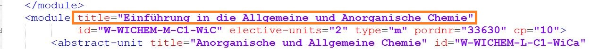

#####Kurse

Bei der Namensänderung von Kursen muss die Datei Moduldaten angepasst werden.  

1. Öffnen der Datei Moduldaten.  

2. Suchen des relevanten Moduls und des zu ändernden Kurses in der Kursübersicht   (1. Hälfte des Dokuments).  

3. Anpassung des Kursnamens durch Eintragung in das Feld `title=""`.

  

4. Scrollen bis zu den konkreten Zeiten der Veranstaltungen (2. Hälfte des Dokuments).  

5. Suchen des Kurses der geändert werden soll.  

6. Anpassung des Namens durch Eintrag in das Feld `title=""`.

####  4.2 Anpassung von Studienganginformationen

Anpassungen die sich direkt auf die Studiengänge beziehen werden in der Datei Modulbaum vorgenommen.  

1. Öffnen der Datei Modulbaum.  

2. Suchen des relevanten Studienganges.  

3. Angepasst werden können die Felder `cp=""_, _abschl=""_, _stg=""_, _kzfa=""_, _pversion=""_, und _name=""` (Bedeutung siehe [Abkürzungsverzeichnis](#abkmb)).

####  4.3 Anpassung von Credit Points

Die Anpassung von Credit Points erfolgt in der Datei Modulbaum, sowie in der Kursüberischt der Datei Moduldaten.  

#####Modulbaum

1. Öffnen der Datei Modulbaum.  

2. Suchen des relevanten Studienganges und des zu ändernden Kurses.  

3. Anpassung der Credit Points für Modul und Studiengang.  
	
	1.  Anpassung der Credit Points pro Modul durch Eintragung in das Feld `cp=""` (rot markiert).   
	
	2. Nachdem die Credit Points in einem oder mehreren Modulen eines Studienganges angepasst wurden, müssen die Angaben zum Studiengang ebenfalls angepasst werden. Anpassung erfolgt durch Eintragung in die Felder `cp=""_, _min-cp=""_ und _max-cp=""` (gelb markiert).

#####Moduldaten

4. Öffnen der Datei Moduldaten.  

5. Suchen des relevanten Moduls.  

6. Die Anpassung der Credit Points wird nun durch Eintragen in das Feld `cp=""` (rot markiert) vorgenommen.

####  4.4 Änderung von Vorlesungs- und Übungszeiten

Bei der reinen Änderung von Veranstaltungszeiten ist nur die zweite Hälfte des Dokuments Moduldaten von Relevanz.  

1.Öffnen der Datei Moduldaten.  

2.Scrollen bis zum Ende der Kursgliederung, welches durch den Ausdruck `</modules>` gekenzeichnet ist.

3.Suchen des Kurses dessen Veranstaltungszeiten geändert werden sollen.  

Nachdem der entsprechende Kurs gefunden wurde hat man mehrere Möglichkeiten:

#####Änderungen bei  bestehenden Gruppen

Kurse bestehen meist aus mehr als nur einer Gruppe, daher ist es wichtig genau die Gruppe auszuwählen die auch verändert werden soll. Nachdem die richtige Gruppe ausfindig gemacht wurde, können die vier Felder unter `session` beliebig verändert werden (Bedeutung siehe [Abkürzungsverzeichnis](#abkmd2)).

 

#####Löschen einer Gruppe  

Sollte ein bestimmter Veranstaltungstermin nicht mehr benötigt werden so kann die Gruppe beliebig gelöscht werden. Bei dem Löschen einer Gruppe ist darauf zu achten, dass der Start-und Endausdruck der Gruppe, also: `<group>` und `</group>`  (rot markiert) mitgelöscht werden.

#####Erstellen neuer Gruppen

Bei dem Erstellen einer neuen Gruppe wird wie folgt vorgegangen:  

1. Anfangswert (`<group>`) setzen.  

2. Zeile Einfügen: `<session day="" time="" duration="" rhythm=""/>`.    

3. Einsetzen der richtigen Zeiten in die Anführungszeichen (alle Felder müssen ausgefüllt werden).  

4. Endwert (`</group>`) setzen.

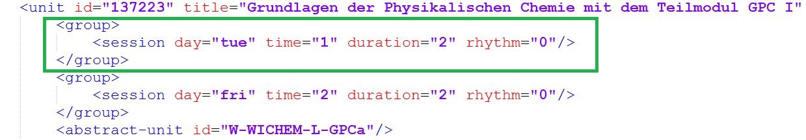

(Grüne Markierung zeigt genau eine vollständige Gruppe)

##5. Zusammenfügen der XML-Dokumente

###  5.1 Zusammenfügen der XML-Dokumente

Um die eingegebenen Daten weiterverwenden zu können, müssen die beiden XML-Dateien Modulbaum und Moduldaten zu einer SQlite-Datei zusammengefügt werden. Hierfür wird die Das Program **mincer** benötigt, nach dem Öffnen der Datei wird folgender Bildschirm angezeigt:

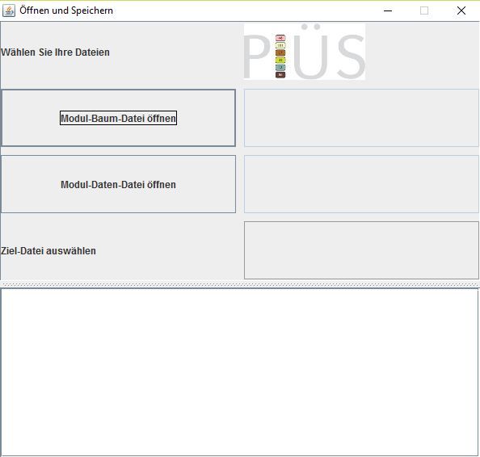  

Nach einem Klick auf das Feld `Modul-Baum-Datei öffnen`, ist nun die Datei Modulbaum auszuwählen. Dies wird mit dem Feld `Modul-Daten-Datei öffnen` und der Datei Moduldaten wiederholt. Nun wird mit einem Klick auf das Feld `Erzeugen und Speichern` die entsprechende SQlite-Datei erstellt.

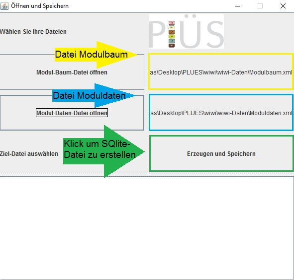  

Als letztes muss nun noch der Speicherort und der Name der neuen SQlite-Datenbank angegeben werden und das Erstellen der neuen Datenbank ist beendet.

#6. Umgang mit der Hauptanwendung

###  6.1 Starten der Hauptanwendung und Einlesen der Daten

Die Hauptanwendung wird durch die Datei **plues-2.0.0-PREVIEW2** gestartet. Nach dem Starten erscheint folgender Bildschirm:

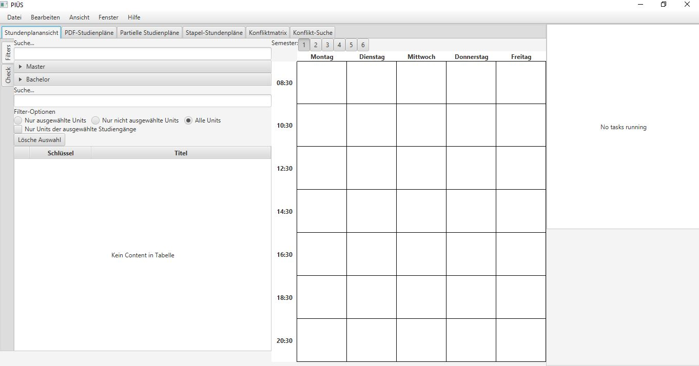

Als nächster Schritt muss die entsprechende Datenbank im Programm geöffnet werden. Hierfür wird wie folgt vorgegangen:

1. Klick auf das Feld `Datei` im oberen linken Teil der Startseite.

2. Klick auf das Feld `Öffnen`. 

3. Auswählen der zu öffnenden Datenbank.

4. Auswahl bestätigen durch Klick auf das Feld `Öffnen`.

Nach dem Öffnen der Datenbank beginnt das Programm mit dem Einlesen der Daten. Angezeigt wird dies auf der rechten Seite des Bildschirms.

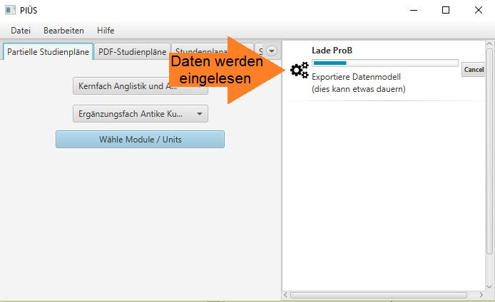

Das Einlesen kann je nach Größe der Datenbank einige Zeit in Anspruch nehmen. Nachdem die Datenbank eingelesen wurde können alle Funktionen des Tools genutzt werden.

##  6.2 Hauptfunktionen

###Übersicht

Das Planungswerkzeug für überschneidungsfreies Studieren bietet verschiedene Funktionen, die die Arbeit mit Studienplänen vereinfachen und somit Überschneidungen verhindern sollen:

1. [Stundenplanansicht](#fba)

2. [PDF-Studienpläne](#fbb)

3. [Partielle Studienpläne](#fbc)

4. [Stapel-Stundenpläne](#fbd)

5. [Konfliktmatrix](#fbe)

6. Unsat Core

Diese sind in im oberen Drittel der Startseite aufgelistet.

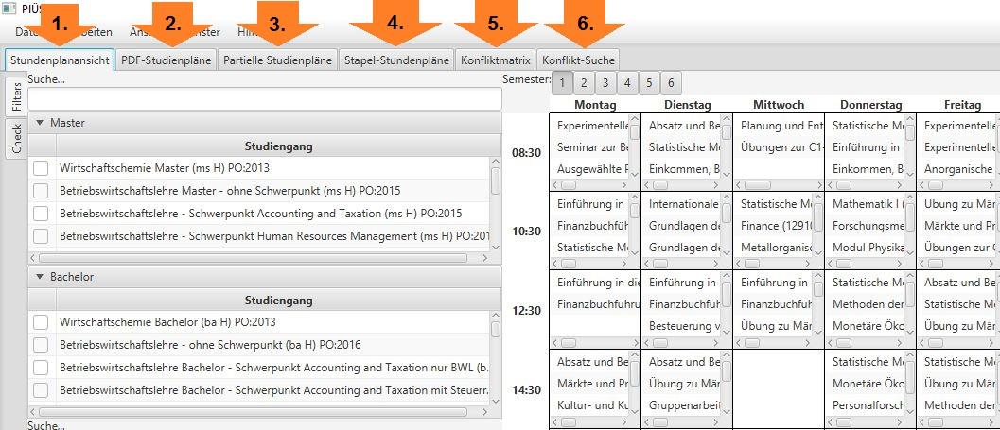

### Stundenplanansicht

####Funktionsbeschreibung

Die Funktion Stundenplansicht ermöglicht es die Veranstaltungszeiten von Kursen zu verändern. Hierfür können die Kurse innerhalb der Übersicht einfach in die gewünschten Zeitslots verschoben werden. Weiterhin ist es möglich die Studierbarkeit der einzelnen Studiengänge zu überprüfen. Hierdurch kann nach der Verschiebung eines Kurses sofort kontrolliert werden, ob es nun zu Überschneidungen in den betroffenen Studiengängen kommt. Sollte es zu Überschneidungen kommen, werden diese ebenfalls angezeigt.

####Bedienung

### PDF-Studienpläne

####Funktionsbeschreibung

Die Funktion PDF-Studienpläne berechnet Studienverlaufspläne von ausgewählten Fächerkombinationen. Hierdurch kann die Studierbarkeit einzelner Fächerkombinationen leicht überprüft werden. Des Weiteren beinhaltet der Studienverlaufsplan mögliche Stundenpläne für die einzelnen Semester und bietet damit eine detailierte Übersicht des Studienganges.

#### Bedienung

1. Auswahl der zu überprüfenden Fächerkombination (Haupt-und Nebenfach).

2. Generieren des Studienverlaufsplans durch Klick auf den Button `Generieren`.

Nun berechnet das Programm den Studienverlaufsplan für die ausgewählte Fächerkombination. Dies sollte nur einen kurzen Moment dauern. 

#####1. Fall: Fächerkombination ist studierbar 

Es erscheint ein grüner Kasten mit einem Haken.   
Nun gibt es drei Möglichkeiten:  

1. Anzeigen des Studienverlaufsplans.

2. Speichern des Studienverlaufsplans.

3. Entfernen des Studienverlaufsplans.

Hierfür klickt man auf das Feld `Anzeigen` und wählt die entsprechende Funktion aus. Bestätigt wird die Auswahl durch einen Klick auf das Feld `Los`.

#####2. Fall: Fächerkombination ist nicht studierbar

Es erscheint ein roter Kasten mit einem Kreuz. Dieser kann durch einen Klick auf den Button `Los` wieder entfernt werden.

### Partielle Studienpläne

#### Funktionsbeschreibung

Die Funktion Partielle Studienpläne ermöglicht eine **Berücksichtigung konkreter Module und Kurse** bei der Erstellung eines Studienverlaufsplanes. Es können Studienverlaufspläne für verschiedene Fächerkombinationen berechnet werden. Hierbei ist es möglich einzelne Module und Kurse auszuwählen, die im Studienverlaufsplan enthalten sein sollen. Dadurch kann geprüft werden, ob eine bestimmte Fächerkombination studierbar ist, unter der Voraussetzung, dass sie bestimmte Veranstaltungen beinhaltet. 

#### Bedienung

1. Auswahl der zu überprüfenden Fächerkombination (Haupt- und Nebenfach).

2. Klick auf das Feld `Wähle Module/Units`.

3. Ankreuzen der zu berücksichtigen Module und Kurse.

4. Starten der Berechnung durch Klick auf das Feld `Check`.

Sollte die ausgewählte Kombination studierbar sein erscheint unter dem Feld `check` ein grüner Kasten mit einem Haken. Nun hat man zwei Möglichkeiten:

1. Anzeigen des Studienverlaufsplanes durch Klick auf das Feld `Anzeigen`.

2. Speichern des Studienverlaufsplanes durch Klick auf das Feld `Speichern`.

Sollte statt dem grünen Kasten ein roter Kasten mit einem Kreuz erscheinen, so ist die gewählte Fächerkombination, unter Berücksichtigung der ausgewählten Module und Kurse, nicht studierbar.

### Stapel-Stundenpläne

#### Funktionsbeschreibung

Unter der Funktion Stapel-Stundenpläne werden die Studienverlaufspläne aller  möglichen Fächerkombinationen an der Fakultät mit einem Klick berechnet.
Die berechneten Studienverlaufspläne könnnen daraufhin als PDF und/oder Zip-Datei auf dem Computer gespeichert werden. 
Die Funktion ermöglicht es schnell und unkompliziert eine umfassende Übersicht, in Form der einzelnen Stundenpläne für jedes Semester, über alle Studiengänge der Fakultät zu erhalten.

#### Bedienung  

1. Klick auf das Feld `Erzeuge alle PDFs`.

Das Tool berechnet nun die Studienverlaufspläne aller Fächerkombinationen an der Fakultät. Dies kann einige Zeit dauern.

Nach dem Berechnen können die Studiengänge auf dem Computer gespeichert werden.

1. Speichern der Studienverlaufspläne als PDF durch Klick auf das Feld `In Ordner exportieren`.

2. Speichern der Studienverlaufspläne als Zip-Datei durch Klick auf das Feld `Zip-Datei exportieren`. 

### Konfliktmatrix

####Funktionsbeschreibung

Unter der Funktion Konfliktmatrix werden alle vorhandenen Studiengänge graphisch in Form einer Matrix dargestellt.

Sie bietet einen Überblick über die Studierbarkeit der einzelnen Fächerkombinationen an der Fakultät.

####Umgang

#####Bedienung

1. Klick auf das Feld `Prüfe alle Kombinationen`.

Nun wird die Studierbarkeit aller Fächerkombinationen überprüft.

#####Bedeutung der Farben:

**grün:** Fächerkombination ist studierbar.

**rot (2 Punkte):** Fächerkombination ist nicht studierbar (Es treten Konflikte/Überschneidungen auf).

**rot (3 Punkte):** Fächerkombination ist generell nicht studierbar (Kombination aus Haupt- und Nebenfach ist nicht studierbar).

**grau:** Die Kombination ist aufgrund des selben Haupt- oder Nebenfaches nicht studierbar (Gleiches Haupt- und Nebenfach wurde ausgewählt).
 

###Unsat Core

####Funktionsbeschreibung

Mit der Funktion Schrittweise Konfliktsuche werden die Konfliktmodule eines Studienganges ermitelt. Konfliktmodule sind Module die sich zeitlich überschneiden und so zu einer nicht Studierbarkeit des Studienganges führen. 

## 6.3 Weitere Funktionen

Neben den Hauptfunktionen verfügt das Programm über weitere wichtige Funktionen. Diese können in der obersten Leiste unter den Feldern `Datei`, `Bearbeiten`, `Ansicht` und `Hilfe` aufgerufen werden. 

Das Feld `Datei` ist in folgende Funktionen unterteilt: 

1. [Speichern und exportieren von Speicherständen](#fca)

2. [Änderungsprotokoll](#fcb)

3. [Bericht](#fcc)

### Speichern und exportieren von Speicherständen

#### Speichern

Um vorgenommene Änderungen zu speichern werden die Funktionen `Speichern` und  `Speichern unter` verwendet. Beide Funktionen sind unter dem Feld `Datei` in der obersten Leiste des Tools aufrufbar.

Die `Speichern` Funktion speichert die Änderungen in der aktuell geöffneten SQlite-Datenbank. 

Durch das Benutzen der `Speichern unter` Funktion wird eine neue SQlite-Datenbank erstellt in der vorgenommene Änderungen abgespeichert werden. Die aktuell geöffnete Datenbank wird hierbei nicht überschrieben sondern verbleibt auf dem Stand, zu dem sie geöffnet wurde.

####Exportieren von Speicherständen

Die Funktion `Exportiere gespeicherten Stand` erstellt auf Basis der verwendeten SQlite-Datenbank neue Modulbaum und Moduldaten XML-Dokumente, welche als Zip-Datei abgespeichert werden können. 

Etwaige Änderungen die mit Hilfe der Stundenplanansicht vorgenommen wurden, sind in diesen XML-Dokumenten enthalten.
 

###  Änderungsprotokoll

####Funktionsbeschreibung

Im Änderungsprotokoll werden die Verschiebungen von einzelnen Veranstaltungen notiert und gespeichert. Das Ziel ist es eine Übersicht über alle verschobenen Veranstaltungen zu erhalten, um so ein problemloses Arbeiten zu gewährleisten. 

Hierbei unterscheidet das Änderungsprotokoll zwischen temporären und persistenten Einträgen. Bei temporären Einträgen handelt es sich um Verschiebungen, welche noch nicht abgespeichert wurden und somit noch veränderbar sind. Persistente Einträge wurden bereits gespeichert und können nur durch eine erneute Verschiebung wieder verändert werden.

Das Änderungsprotokoll enthält neben den Namen der verschobenen Veranstaltungen auch Informationen über die betroffenen Zeitslots, sowie das Datum und die Uhrzeit an dem die Änderung vorgenommen wurde.

####Übersicht

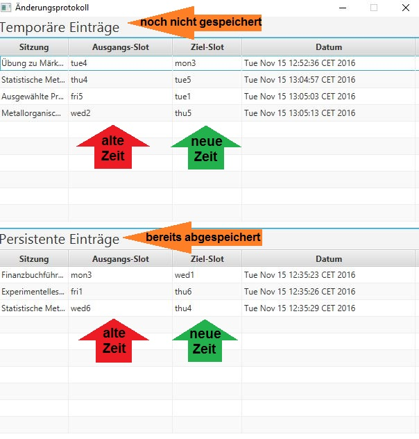

 Unter den temporären Änderungen befinden sich alle aktuell durchgeführten Anpassungen. Ein temporärer Eintrag wird erst zu einem persistenten Eintrag wenn die Änderungen gespeichert wurden und die neuentstandene SQlite-Datenbank mit dem Programm geöffnet wurde. Das Speichern erfolgt durch die Funktionen [Speichern](#ww) oder [Speichern unter](#ww).

###  Bericht

####Allgemeine Beschreibung

Neben dem Änderungsprotokoll bietet das Planungswerkzeug für überschneidungsfreies Studieren ebenfalls die Möglichkeit sich einen Bericht anzeigen zu lassen. In diesem sind verschiedene Funktionen aufgelistet die bei der korrekten Erstellung der XML-Dokumente behilflich sein sollen. Des Weiteren beinhaltet er eine Gesamtstatistik der geöffneten Datenbank, in der z.B. die Anzahl der Studiengänge oder die Gesamtanzahl aller Gruppen aufgelistet ist.

####Umfang und Kategorien

Der Bericht ist in sechs einzelne Kategorien gegliedert:

1. [Unmögliche Studiengänge](#xa)

2. [Abstrakte Units ohne konkrete Ausprägung](#xb)

3. [Abstrakte Units mit konkreter Ausprägung in unterschiedlichen Semestern](#xc)

4. [Pflichtfächer pro Studiengang](#xd)

5. [Quasi-Pflichtfächer pro Studiengang](#xe)

6. [Redundante Unit Gruppen](#xf)

#####  1.Unmögliche Studiengänge

In der Kategorie `Unmögliche Studiengänge` sind alle Studiengänge aufgelistet die grundsätzlich nicht studierbar sind. Der Grund für die nicht Studierbarkeit des Studienganges ist hierbei nicht die Überschneidung von Veranstaltungen, sondern eine generelle nicht Studierbarkeit. Diese kann bei Fächerkombinationen auftreten die sich nicht miteinander vernüpfen lassen. Sollten hier ein alleinstehender Studiengang aufgelistet sein, so wurde dieser wahrscheinlich unvollständig oder fehlerhaft in die XML-Dokumente eingetragen. 

#####  2.Abstrakte Units ohne konkrete Ausprägung

Die Kategorie `Abstrakte Units ohne konkrete Ausprägung` beinhaltet alle Kurse, die in der [Kursgliederung](#bc) des Dokuments Moduldaten aufgelistet sind, denen aber keine konkreten Veranstaltungen im [Veranstaltungsverzeichnis](#bd) des Dokuments Moduldaten zugeordnet sind. 

Es gibt meist zwei Ursachen für dieses Problem:

1. Die IDs des Kurses in der Kursgliederung oder der Veranstaltung im Veranstaltungsverzeichnis wurden fehlerhaft eingetragen, weshalb die IDs voneinander abweichen und somit keine Zuordnung stattfinden kann.

2.  Es wurde keine konkrete Veranstaltung im Veranstaltungsverzeichnis eingetragen, da z.B. die Termine noch nicht bekannt sind oder die Veranstaltung aktuell nicht stattfindet.

Beide Fälle führen dazu, dass der Kurs bei der Überprüfung der Studierbarkeit und der Berechnung des Studienverlaufsplans nicht berücksichtigt wird. Dies kann zur fehlerhaften Berechnung des Studienplanes oder zur nicht Studierbarkeit des Studienganges führen.

Daher ist es wichtig etwaige Eintragungsfehler zu berichtigen und fehlende Daten schnellstmöglich nachzutragen, um so Fehler zu vermeiden. 

#####  3. Abstrakte Units mit konkreter Ausprägung in unterschiedlichen Semestern

Unter dieser Kategorie sind alle Kurse aufgelistet bei denen die Semestereintragungen in der [Kursgliederung](#bc) und im [Veranstaltungsverzeichnis](#bd) des Dokuments Moduldaten voneinander abweichen. Sollte dies der Fall sein liegt ein Eintragungsfehler vor, welcher berichtigt werden sollte.

Hierfür vergleicht man die Semestereintragungen des Kurses in der Kursgliederung und im Veranstaltungsverzeichnis des Dokuments Moduldaten mit den tatsächlichen Zeiten und berichtigt die Abweichungen.

Abweichende Semestereintragungen führen dazu, dass ein Kurs und damit meist das gesamte Modul bei der Überprüfung der Studierbarkeit und der Erstellung eines Studienverlaufsplanes des Studienganges nicht berücksichtigt wird. Hierdurch kann es passieren, das Fächerkombinationen als nicht studierbar angezeigt werden, obwohl sie es eigentlich sind.

#####  4. Pflichtfächer pro Studiengang

Die Kategorie `Pflichtfächer pro Studiengang` umfasst alle Module die laut Prüfungsordnung zum Abschluss des Studienganges zwingend belegt werden müssen. 

Im oberen Abschnitt könnnen die einzelnen Studiengänge ausgewählt werden, woraufhin im unteren Abschnitt die Pflichtfächer des ausgewählten Studienganges angezeigt werden.

#####  5. Quasi-Pflichtfächer pro Studiengang

In der Kategorie `Quasi-Pflichtfächer pro Studiengang` sind alle Module eines Studiengangs aufgelistet, welche in der Prüfungsordnung nicht als Pflichtmodule aufgelistet sind, bei denen eine Belegung jedoch notwendig ist um den gewählten Studiengang zu studieren.

Der Aufbau ist identisch mit dem aus Kategorie 4, sodass im oberen Abschnitt die Auswahl des konkreten Studienganges erfolgt und daraufhin im unteren Abschnitt die Quasi-Pflichtfächer des ausgewählten Studienganges angezeigt werden.

#####  6. Redundante Unit Gruppen

Unter der Kategorie `Redundante Unit Gruppen` sind Gruppen des selben Kurses aufgelistet, bei denen alle zeitlichen Eintragungen gleich sind.
Dies bedeutet, dass die abgebildeten Gruppen mehrfach im [Veranstaltungsverzeichnis](#bd) des Dokuments Moduldaten eingetragen wurden.

Um dies zu berichtigen muss man den aufgelisteten Kurs im Veranstaltungsverzeichnis suchen und entsprechende doppelte Gruppeneintragungen löschen. 

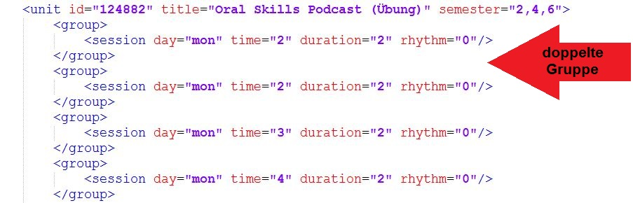

##Häufig auftretende Fehler

###  Beim Programmstart

Beim erstmaligen Starten des Programms kann es zu einigen Fehlern kommen. Sollte das Programm auf einem neuem Rechner nicht funktionieren sind folgende Punkte zu beachten:

#####Systemanforderungen und Java-Version

Damit das Programm fehlerfrei funktioniert wird ein Rechner mit einem 64-bit Betriebssystem und mindestens 4 GB Arbeitsspeicher benötigt. Des weiteren muss mindestens eine Java 8 64-bit Version installiert sein.

**Hinweis:** Es ist wichtig das es sich um eine 64-bit Java-Version handelt. Nicht auf jedem Rechner mit 64-bit Betriebssystem ist automatisch eine 64-bit Java-Version installiert, sondern oft auch nur eine 32-bit Version. Dies ist zu überprüfen.

#####Speichern auf Netzwerklaufwerken

Sollten die Daten und/oder das Programm auf einem Netzwerklaufwerk gespeichert sein und nicht auf der Festplatte des Computers, kann es zu Fehlern beim Start des Programms kommen. Das Speichern auf Netzwerklaufwerken ist daher zu vermeiden.

###  Beim Einlesen der Datenbanken

Beim Einlesen einer Datenbank mithilfe der Hauptanwendung kann es zu folgender Fehlermeldung kommen.

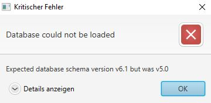

Sollte diese Fehlermeldung auftreten handelt es sich bei der einzulesenden Datenbank um eine Datenbank, die nach einem veralteten Schema erstellt wurde. Dies kommt dann vor, wenn die Datenbank mit einer älteren Mincer-Version erstellt wurde.  

**Lösung:** Entweder neueste Datenbank runterladen, oder mit der aktuellen Mincer-Version eine Datenbank aus den selben Modulbaum und Moduldaten Dateien erstellen, die bei der veralteten Datei verwendet wurden.

###  Beim Zusammenfügen der XML-Dokumente

Beim Zusammenfügen der XML-Dokumente mit der Anwendung Mincer kann es zu verschiedenen Fehlermeldungen kommen. Bei dem Großteil der Fehlermeldungen ist die entsprechende fehlerhafte Stelle im Dokument bereits angegeben. Hiervon ausgenommen sind die Fehlermeldungen:

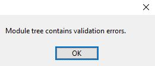

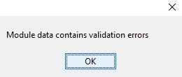

Solch eine Fehlermeldung entsteht, wenn bestimmte Studiengänge oder Module nicht eindeutig voneinander unterschieden werden können, sondern mehrmals auftreten.

**Lösung:** Im Fehlerprotokoll der Anwednung Mincer (untere Hälfte) wird die fehlerhate Eintragung angezeigt. Diese muss nun in den Dokumenten gesucht und berichtigt werden, sodass die Eintragungen wieder eindeutig sind.

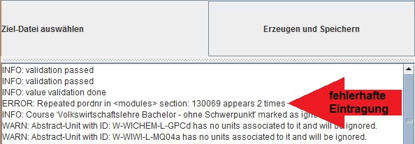