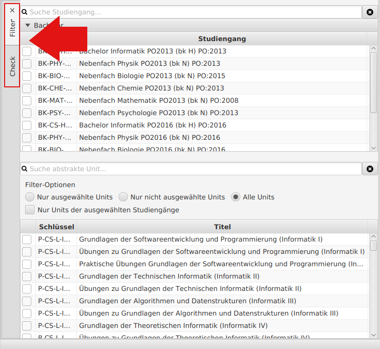

# Planungswerkzeug für überschneidungsfreies Studieren (PlüS)

## Inhalt

### 1. Einführung  

##### [1.1 Bestandteile und Aufbau](#aa)

##### [1.2 Ziele und Funktionen](#ab)

##### [1.3 Systemanforderungen](#ac)

### 2. Umgang mit der Hauptanwendung

##### [2.1 Starten der Hauptanwendung und Einlesen der Daten](#fa)

##### [2.2 Hauptfunktionen](#fb)

##### [2.3 Weitere Funktionen](#fc)

### 3. Anwendungsmöglichkeiten

##### [3.1 Anwendungsmöglichkeiten der Hauptanwendung](#wa) 

##### [3.2 Arbeiten mit den XML-Dokumenten](#wb) 

### 4. Beschreibung und Aufbau der XML-Dokumente  

##### [4.1 Übersicht und allgemeine Hinweise](#ba)  

##### [4.2 Modulbaum](#bb)  

##### [4.3 Moduldaten Kursgliederung (1. Hälfte)](#bc)  

##### [4.4 Moduldaten Veranstaltungsverzeichnis (2. Hälfte)](#bd)

### 5. Eingabe neuer Daten 

##### [5.1 Erstellen neuer Studiengänge](#ca)  

##### [5.2 Erstellen neuer Module](#cb)  

##### [5.3 Erstellen neuer Kurse](#cc)  

### 6. Änderungen bei bereits bestehenden Veranstaltungen  

##### [6.1 Namensänderungen von Modulen und Kursen](#da)  

##### [6.2 Änderung von Studienganginformationen](#db)

##### [6.3 Anpassung von Credit Points](#dc)

##### [6.4 Änderung von Vorlesungs- und Übungszeiten](#dd)

### 7. Zusammenfügen der XML-Dokumente

##### [7.1 Zusammenfügen der XML-Dokumente](#ea)

### 8. Häufig auftretende Fehler

##### [8.1 Beim Starten des Programms](#ga)

##### [8.2 Beim Einlesen der Datenbank](#gb)

##### [8.3 Beim Zusammenfügen der XML-Dokumente](#gc)

## 1. Einführung:

###  1.1 Bestandteile und Aufbau

Das Planungswerkzeug für überschneidungsfreies Studieren besteht aus **vier Hauptbestandteilen**:

1. **Zwei XML-Dokumente (Modulbaum und Moduldaten)** ([Download][raw-data])

2. **Mincer zum Zusammenfügen der Dokumente** ([Windows][mincer-windows-download] [MacOs/Linux][mincer-jar-download])

3. **SQlite-Datenbank** ([Download][data-release])

4. **Hauptanwendung** ([Download][plues-release])

Als Grundlage dienen zwei XML-Dokumente, der Modulbaum und die Moduldaten. Diese enthalten alle relevanten Informationen der einzelnen Kurse und Module eines Studienganges, sowie die genauen Veranstaltungszeiten. Die Anwendung mincer fügt diese beiden Dateien zu einer gemeinsamen SQlite- Datenbank zusammen, welche als Grundlage für die Hauptanwendung dient. Nachdem die SQlite-Datenbank von der Hauptanwendung geöffnet wurde, ist diese funktionsfähig.

###  1.2 Ziele und Funktionen

Das Hauptziel des Planungswerkzeuges für überschneidungsfreies Studieren ist es alle möglichen Modul- und Kurskombinationen eines Studienganges in einem Programm  bereitszustellen und zu überprüfen. Hierdurch soll gewährleistet werden, dass jeder Student in der Lage ist sein Studium in der vom Curriculum vorgeschriebenen Regelstudienzeit zu absolvieren. Mögliche zeitliche Konflikte und Überschneidungen von einzelnen Kursen und Modulen sollen so besser gelöst werden.

Um diese Ziele zu erreichen bietet das Planungswerkzeug eine vollständige Übersicht aller an der Fakultät angebotenen Veranstaltungen. Des Weiteren ist es in der Lage einzelne Veranstaltungen zu verschieben und die Studierbarkeit verschiedener Fächerkombinationen zu überprüfen. Sollte eine Fächerkombination studierbar sein, so wird sogleich ein möglicher Studienverlaufsplan hierzu angezeigt. Falls ein Student einen besonderen Wert auf das Belegen einzelner Veranstaltungen legt, ist es ebenfalls möglich dieses beim Berechnen des Studienverlaufsplans zu berücksichtigen.

###  1.3 Systemanforderungen

Um ein vernünftiges Arbeiten mit dem Planungswerkzeug für überschneidungsfreies Studieren zu gewährleisten wird ein Rechner mit mindestens **4 Gigabyte Arbeitsspeicher** und einem **64-bit Betriebssystem** benötigt. Des Weiteren ist das Programm **java 8 64-bit**   ([Download][java-download]) erforderlich.

# 2. Umgang mit der Hauptanwendung

###  2.1 Starten der Hauptanwendung und Einlesen der Daten

Die Hauptanwendung wird durch die Datei **plues-2.7.0** gestartet. Nach dem Starten erscheint folgender Bildschirm:

Als nächster Schritt muss die entsprechende Datenbank im Programm geöffnet werden. Hierfür wird wie folgt vorgegangen:

1. Klick auf das Feld `Datei` im oberen linken Teil der Startseite.

2. Klick auf das Feld `Öffnen`. 

3. Auswählen der zu öffnenden Datenbank.

4. Auswahl bestätigen durch Klick auf das Feld `Öffnen`.

Nach dem Öffnen der Datenbank beginnt das Programm mit dem Einlesen der Daten. Angezeigt wird dies anhand des Ladebalkens am rechten unteren Rand des Bildschirms(siehe Abbildung). 

Durch einen Klick auf den Balken erhält man eine genauere Übersicht über die laufenden Prozesse. Es wird folgendes angezeigt:

Das Einlesen kann je nach Größe der Datenbank einige Zeit in Anspruch nehmen. Nachdem die Datenbank eingelesen wurde können alle Funktionen des Tools genutzt werden.

##  2.2 Hauptfunktionen

### Übersicht

Das Planungswerkzeug für überschneidungsfreies Studieren bietet verschiedene Funktionen, die die Arbeit mit Studienplänen vereinfachen und somit Überschneidungen verhindern sollen:

1. [Studienplanansicht](#fba)

2. [PDF-Studienpläne](#fbb)

3. [Partielle Studienpläne](#fbc)

4. [Alle Studienpläne](#fbd)

5. [Konfliktmatrix](#fbe)

6. [Konfliktsuche](#fbf)

Diese sind im oberen Drittel der Startseite aufgelistet:

###  Studienplanansicht

#### Funktionsbeschreibung

Die Funktion Studienplanansicht ermöglicht es einzelne Veranstaltungen zu verschieben, um so Veranstaltungszeiten anzupassen. Hierfür können die Veranstaltungen innerhalb der Übersicht einfach in die gewünschten Zeitslots verschoben werden. Weiterhin kann die Studierbarkeit der einzelnen Studiengänge überprüft werden. Hierdurch wird nach der Verschiebung eines Kurses kontrolliert, ob es zu Überschneidungen in den betroffenen Studiengängen kommt. Ensprechende Überschneidungen werden daraufhin angezeigt. Zur einfacheren Bedienung sind zusätzlich noch Filter vorhanden, mit denen einzelne Studiengänge und Veranstaltungen in der Studienplanansicht herausgefiltert werden können.

#### Aufbau

Auf der rechten Seite ist die Studienplanansicht abgebildet. In dieser sind alle Kurse der Fakultät aufgelistet und in ihre jeweiligen Zeitslots unterteilt.
Auf der linken Seite der Funktion können die Filter ausgewählt, sowie die Studierbarkeit einzelner Studiengänge kontrolliert, werden. Um zwischen den Filtern und der Studiengangkontrolle zu wechseln werden die beiden buttons `check`und `filter` auf der linken Seite der Funktion benutzt (siehe Abbildung).
Durch weitere Klicks auf die buttons `check`und `filter`,können die Filter und das Menü zur Kontrolle der Studiengänge ausgeblendet und wieder eingeblendet werden.

#### Filtern der Kurse

Die Kurse in der Studienplanansicht können sowohl nach Studiengängen, als auch nach einzelnen Kursen gefiltert werden. Die Studiengänge können in der oberen Hälfte ausgewählt werden und sind in Bacholer und Master Studiengänge unterteilt. Neben den Studiengängen können in der unteren Hälfte einzelne Kurse ausgewählt werden. Falls ein bestimmter Kurs ausgewählt werden soll, kann dieser mit Hilfe der Suchfunktion (siehe Abbildung) einfach ausfindig gemacht werden. Des Weiteren kann die Anzahl der aufgelisteten Kurse, mithilfe der Filter-Optionen (siehe Abbildung), angepasst werden. Es gibt folgende Möglichkeiten:

1. **Nur ausgewählte units:** Es werden nur Kurse angezeigt die bereits ausgewählt wurden.

2.  **Nur nicht ausgewählte Units:** Es werden alle Kurse angezeigt die noch nicht ausgewählt wurden.

3. **Alle units:** Es werden alle Kurse der Fakultät angezeigt.

4. **Nur units der ausgewählten Studiengänge:** Es werden nur Kurse der in der oberen Hälfte ausgewählten Studiengänge angezeigt.

**Beachte:** Die Filter-Optionen beeinflussen nur die aufgelisteten Kurse im linken unteren Abschnitt der Funktion (siehe Abbildung). Um die Studienplanansicht auf der rechten Seite zu filtern, müssen einzelne Studiengänge oder Kurse auf der linken Seite ausgewählt werden.

#### Verschiebung von Sitzungen

1. Zu verschiebende Sitzung in der Studienplanansicht raussuchen.

2. Linksklick auf die Sitzung und linke Maustaste gedrückt halten.

3. Sitzung in den gewünschten Zeitslot schieben und linke Maustaste währenddessen gedrückt lassen.

4. Linke Maustaste loslassen.

Nun wird die Sitzung in den entsprechenden Zeitslot verschoben.

**Hinweis:** Es sind nur Verschiebungen innerhalb eines Semesters möglich.

#### Verschieben einer Sitzung während Berechnungen laufen

Das Verschieben einer Sitzung verändert den Zustand der Anwendung, so dass aktuell laufende Berechnungen beeinflusst werden können. Sollten also bereits Berechnungen statt finden, so erscheint vor dem Verschieben einer Sitzung eine Warnmeldung. Hierbei kann sich wie folgt entschieden werden:

1. `Verschieben`: Ignoriere die Warnung und verschiebe die Sitzung.

**Hinweis:** Für bereits laufende Berechnungen kann nicht garantiert werden, welcher Zustand der Datenbank verwendet wird. Also jener vor oder nach dem Verschieben der Sitzung.

2. `Alles abbrechen und verschieben`: Es werden alle aktuell laufenden Berechnungen abgebrochen und im Anschluss daran die Sitzung verschoben.

3. `Abbrechen`: Das Verschieben der Sitzung wird abgebrochen.

#### Kursdetails anzeigen

Um sich in der Studienplanansicht nähere Informationen zu einem Kurs anzeigen zu lassen, ist ein Doppelklick auf den jeweiligen Kurs nötig. Daraufhin erscheint folgendes Fenster:

Im Abschnitt **Kurs-Verteilung** sind alle Studiengänge aufgelistet, in welchen der ausgewählte Kurs vorkommt. Zusätzlich ist noch das Modul angegeben, zu dem der Kurs gehört, sowie das Semester in dem er stattfindet und ob es sich um einen Pflicht- oder Wahlkurs handelt.

#### Überprüfung der Studierbarkeit

1. Klick auf den Button `Check` im linken oberen Abschnitt der Funktion.

2. Auswählen des zu überprüfenden Studiengangs oder Faches.

3. Klick auf den Button `Prüfe Erfüllbarkeit`.

Nun wird die Studierbarkeit des gewählten Studienganges berechnet. Hierbei wird nach drei Arten unterschieden; studierbare Studiengänge, nicht studierbare Studiengänge und generell nicht studierbare Studiengänge.

##### Studierbare Studiengänge

Studierbare Studiengänge können nun in der Studienplanansicht hervorgehoben
werden. Hierfür wird die Funktion `Im Studienplan hervorheben` ausgewählt und
mit einem Klick auf den Button `Los` bestätigt. Nun wählt das Programm
automatisch den entsprechenden Filter aus, sodass nur noch die Kurse des
entsprechenden Studiengangs angezeigt werden.

Des Weiteren kann der Studiengang erneut, unter der Berücksichtigung spezieller
Kurse, berechnet werden. Hierfür wird die Funktion `Partiellen Studienplan
generieren` ausgewählt und mit einen Klick auf den Button `Los` bestätigt. Nun
leitet einen das Programm zu der Hauptfunktion [Partielle Studienpläne](#fbc)
weiter.

##### Nicht studierbare Studienänge

Bei Studiengängen, die aufgrund von Konflikten nicht Studierbar sind, können
nun die Konfliktsitzungen berechnet werden.

1. Auswählen der Funktion `Konflikt Bestimmen`. 

2. Klick auf den Button `Los`.

Die Konfliktsitzungen des Studieganges werden daraufhin berechnet und
angezeigt. Diese können durch einen Klick auf den Button `Konflikte
hervorheben`, in der Studienplanansicht markiert werden.

Bei markierten Konflikten wird sowohl der Zeitslot, in dem der Konflikt liegt,
rot umrandet, als auch die entsprechenden Konfliktkurse rot hervorgehoben. Des
Weiteren werden noch die Semester hervorgehoben, in denen die Konfliktkurse
stattfinden.

Sobald ein Konflikt hervorgehoben wurde, erscheint neben den Button `Prüfe
Erfüllbarkeit` ein weiterer Button mit der Bezeichnung `Hebe Konflikte nicht
hervor`. Hiermit kann die Hervorhebung rückgängig gemacht werden.

##### Generell nicht studierbare Studiengänge

Mit generell nicht studiebaren Studiengängen kann nicht weiter gearbeitet
werden. Sie können nur, durch einen Klick auf den Button `Los`, entfernt
werden.

#### Weitere Funktionen

##### Studienplanansicht ändern

Durch die Funktion `Ansicht` in der oberen Leiste kann gewählt werden, ob in
der Studienplanansicht die `Unit Title`, die `UnitID/Gruppen` oder die
`abstrakten Unit Schlüssel` angezeigt werden. Für nähere Informationen
[hier](#fdc) klicken.

##### Änderungen speichern

Veranstaltungsverschiebungen, die Mithilfe der Studienplanansicht vorgenommen
wurden, können mithilfe der Funktionen `Speichern` und `Speichern unter`,
welche in der obersten Leiste unter dem Feld `Datei`aufgerufen werden können,
gespeichert werden. Für nähere Informationen klicken sie [hier](#fcb).

### PDF-Studienpläne

#### Funktionsbeschreibung

Die Funktion PDF-Studienpläne berechnet Studienverlaufspläne von ausgewählten
Fächerkombinationen. Hierdurch kann die Studierbarkeit einzelner
Fächerkombinationen leicht überprüft werden. Des Weiteren beinhaltet der
Studienverlaufsplan mögliche Studienpläne für die einzelnen Semester und bietet
damit eine detailierte Übersicht des Studienganges.

#### Bedienung

1. Auswahl der zu überprüfenden Fächerkombination (Haupt-und Nebenfach).

2. Auswahl des Farbschemas, welches zur Unterscheidung der einzelnen Module im generierten PDF-Studienplan verwendet wird.

3. Generieren des Studienverlaufsplans durch Klick auf den Button `Generieren`.

Nun berechnet das Programm den Studienverlaufsplan für die ausgewählte
Fächerkombination. Dies sollte nur einen kurzen Moment dauern. Es gibt drei
mögliche fälle, die sich nach dem Berechnen es Studienverlaufsplanes einstellen
können; der Studiengang ist studierbar, es kam zu einer Zeitüberschreitung beim
Berechnen oder der Studiengang ist nicht studierbar.

##### 1. Fall: Fächerkombination ist studierbar

Es erscheint ein grüner Kasten mit einem Haken.
Nun gibt es mehrere Möglichkeiten:

1. **Anzeigen:** Studienverlaufsplan wird als PDF angezeigt.

2. **Speichern:** Studienverlaufsplan wird auf dem Computer gespeichert.

3. **In Studienplanansicht öffnen:** Entsprechender Studiengang wird in der Funktion [Studienplanansicht](#fba) angezeigt.

4. **Partiellen Studienplan generieren:** Entsprechender Studiengang wird in der Funktion [Partielle Studienpläne](#fbc) angezeigt.

5. **Entfernen:** Studienverlaufsplan wird wieder entfernt.

Hierfür klickt man auf das Feld `Anzeigen` und wählt die entsprechende Funktion aus. Bestätigt wird die Auswahl durch einen Klick auf das Feld `Los`.

##### 2. Fall: Zeitüberschreitung beim Berechnen

Es erscheint ein gelber Kasten mit einem Fragezeichen. Nun hat man folgende Möglichkeiten:

1. **In Studienplanansicht öffnen:** Entsprechender Studiengang wird in der Funktion [Studienplanansicht](#fba) angezeigt.

2. **Berechnung neu starten:** Berechnung des Studienverlaufsplans wird neu gestartet (Timeout sollte davor unter dem tab [Bearbeiten](#fdb) angepasst werden). 

3. **Entfernen:** Studienverlaufsplan wird wieder entfernt.

##### 3. Fall: Fächerkombination ist nicht studierbar

Es erscheint ein roter Kasten mit einem Kreuz. Nun hat man folgende Möglichkeiten:

1. **In Studienplanansicht öffnen:** Entsprechender Studiengang wird in der Funktion [Studienplanansicht](#fba) angezeigt.

2. **Entfernen:** Studienverlaufsplan wird wieder entfernt.

### Partielle Studienpläne

#### Funktionsbeschreibung

Die Funktion Partielle Studienpläne ermöglicht eine **Berücksichtigung
konkreter Module und Kurse** bei der Erstellung eines Studienverlaufsplanes. Es
können Studienverlaufspläne für verschiedene Fächerkombinationen berechnet
werden. Hierbei ist es möglich einzelne Module und Kurse auszuwählen, die im
Studienverlaufsplan enthalten sein sollen. Dadurch kann geprüft werden, ob eine
bestimmte Fächerkombination studierbar ist, unter der Voraussetzung, dass sie
bestimmte Veranstaltungen beinhaltet. 

#### Bedienung

1. Auswahl der zu überprüfenden Fächerkombination (Haupt- und Nebenfach).

2. Klick auf das Feld `Wähle Module/Units`.

3. Ankreuzen der zu berücksichtigenden Module und Kurse.

4. Starten der Berechnung durch Klick auf das Feld `Check`.

Sollte die ausgewählte Kombination studierbar sein, erscheint unter dem Feld `check` ein grüner Kasten mit einem Haken. Nun hat man zwei Möglichkeiten:

1. Anzeigen des Studienverlaufsplanes durch Klick auf das Feld `Anzeigen`.

2. Speichern des Studienverlaufsplanes durch Klick auf das Feld `Speichern`.

Sollte statt dem grünen Kasten ein roter Kasten mit einem Kreuz erscheinen, so ist die gewählte Fächerkombination, unter Berücksichtigung der ausgewählten Module und Kurse, nicht studierbar.

### Alle Studienpläne

#### Funktionsbeschreibung

Unter der Funktion `Alle Studienpläne` werden die Studienverlaufspläne aller
möglichen Fächerkombinationen an der Fakultät mit einem Klick berechnet.
Die berechneten Studienverlaufspläne könnnen daraufhin als PDF und/oder
Zip-Datei auf dem Computer gespeichert werden.  Die Funktion ermöglicht es
schnell und unkompliziert eine umfassende Übersicht, in Form der einzelnen
Studienpläne für jedes Semester, über alle Studiengänge der Fakultät zu
erhalten.

#### Bedienung  

1. Wähle ein Farbschema aus, welches zur Unterscheidung der einzelnen Module in den generierten PDF-Studienplänen verwendet wird.

2. Klick auf das Feld `Erzeuge alle PDFs`, um die Generierung zu starten.

Das Tool berechnet nun die Studienverlaufspläne aller Fächerkombinationen an der Fakultät. Dies kann einige Zeit dauern.

Nach dem Berechnen können die Studiengänge auf dem Computer gespeichert werden.

1. Speichern der Studienverlaufspläne als PDF durch Klick auf das Feld `In Ordner exportieren`.

2. Speichern der Studienverlaufspläne als Zip-Datei durch Klick auf das Feld `Zip-Datei exportieren`.

### Konfliktmatrix

##### Funktionsbeschreibung

Unter der Funktion Konfliktmatrix werden alle vorhandenen Studiengänge, graphisch in Form einer Matrix, dargestellt.  Sie bietet einen Überblick über die Studierbarkeit aller Studiengänge der Fakultät. 

##### Ansicht

Die Ansicht ist unterteilt in Kombinations-Studiengänge, integrative Studiengänge und einzelne Studiengänge. Kombinations-Studiengänge bestehen aus Haupt- und Nebenfach. Bei integrativen Studiengängen handelt es sich um integrierte Studiengänge die ohne die Wahl eines weiteren Fachs studierbar sind. Unter der Kategorie einzelne Studiengänge sind alle Fächer einer Fakultät, also sowohl integrative Studiengänge als auch Haupt- und Nebenfächer aufgelistet.

Des Weiteren ist im oberen Abschnitt eine Übersicht gegeben, in der die Gesamtanzahl aller **erfüllbaren Studiengänge**, **nicht erfüllbaren Studiengänge**, **generell nicht efüllbaren Studiengänge** und **Zeitüberschreitungen** bei der Berechnung von Studiengängen angezeigt wird. 

##### Bedienung

1. Klick auf das Feld `Prüfe alle Kombinationen`.

Nun wird die Studierbarkeit aller Studiengänge überprüft. Hierzu zählen sowohl Kombinations-Studiengänge, sowie integrative und einzelne Studiengänge.

##### Bedeutung der Farben:

**grün (1 Punkt):** Studiengang ist studierbar.

**rot (2 Punkte):** Studiengang ist nicht studierbar (Es treten Konflikte/Überschneidungen zwischen Haupt- und Nebenfach auf).

**gelb (3 Punkte):** Das Zeitlimit bei der Berechnung des Studienganges wurde überschritten. Die Zeitgrenzen können individuell angepasst werden (siehe [Setze Timeout](#fdb)).

**rot (4 Punkte):** Studiengang ist generell nicht studierbar. Grund für die Nichtstudierbarkeit ist hierbei nicht ein Konflikt zwischen Haupt- und Nebenfach, sondern eine generelle Nichtstudierbarkeit eines Teils des Studienganges (siehe [Unmögliche Studiengänge](#xa)).

**grau (5 Punkte):** Die Kombination ist aufgrund des selben Haupt- und Nebenfaches nicht studierbar (Gleiches Haupt- und Nebenfach wurde ausgewählt).
 
**weiß**: Weiße Felder bedeuten, dass die Studierbarkeit des relevanten Studienganges noch nicht berechnet wurde. Dies tritt auf, wenn eine Überprüfung manuell abgebrochen wird.

###  Konfliktsuche

#### Funktionsbeschreibung

Mit der Funktion Schrittweise Konfliktsuche werden zeitliche Konflikte innerhalb eines Studienganges berechnet. Bei der Berechnung dieser Konflikte geht das Programm schrittweise vor, um so die zeitlichen Konflikte in jeder Gliederungsebene angeben zu können. Als erstes werden die betroffenen Konfliktmodule berechnet. Um die Konflikte präziser darzustellen, können nun die betroffenen Kurse und als letzter Schritt die konkreten Gruppen berechnet werden. 

Es werden sowohl zeitliche Konflikte, zwischen Modulen innerhalb eines Fachs, berechnet, als auch Konflikte zwischen Modulen des Haupt- und Nebenfachs eines Studienganges. 

#### Bedienung
Zur Berechnung der zeitlichen Konflikte eines Studienganges wird wie folgt vorgegangen:

##### 1. Konfliktmodule berechnen

1. Klick auf den Button `Konfliktmodule berechnen`.

Nun werden alle Module bei denen es zu Überschneidungen kommt angezeigt. Neben der **PordNr** und dem **Namen** des Moduls, wird zusätzlich noch angegeben, ob es sich um ein **Wahl- oder Pflichtmodul** handelt (Kreuz bedeutet Pflichtmodul).

##### 2. Konfliktkurse berechnen

1. Klick auf den Button `Konflikt-Abstrakte-Lehrveranstaltungen Berechnen`.

Nun werden die konkreten Kurse der Konfliktmodule angezeigt, die für die Überschneidung verantwortlich sind. Es wird sowohl die **Abkürzung** des Kurses, dessen **Titel**, das **Semester** in dem er stattfindet, sowie eine Angabe, ob es sich um einen **Wahl- oder Pflichtkurs** für das Modul handelt, angegeben.

 

##### 3. Konfliktgruppen berechnen

1. Klick auf den Button `Konflikt-Lehrveranstaltungen und Gruppen Berechnen`.

Nun werden die konkreten Gruppen angezeigt, die im Konflikt zueinander stehen. Neben dem **Titel**, der **Abkürzung** und der **ID** der Gruppe werden auch Informationen zur genauen **Uhrzeit** und den **Semestern**, in denen die Gruppe stattfindet angegeben. 

##### 4. Konflikt-Sitzungen

1. Klick auf den Button `Konflikt-Sitzungen Berechnen`

Es werden die Sitzungen der Module angezeigt, die zur gleichen Zeit stattfinden und sich daher überschneiden. Neben dem **Titel** der Sitzung und ihrem **Schlüssel**, wird außerdem noch der Wochentag angezeigt, an dem es zur Überschneidung kommt.

## 2.3  Weitere Funktionen

Neben den Hauptfunktionen verfügt das Programm über weitere wichtige Funktionen. Diese können in der obersten Leiste unter den Feldern [Datei](#fda), [Bearbeiten](#fdb), [Ansicht](#fdc), [Fenster](#fdd) und [Hilfe](#fde) aufgerufen werden. 

###  Datei
Das Feld Datei ist in folgende Funktionen unterteilt: 

1. [Öffnen](#fca)(Strg+O) 

2. [Speichern/Speichern unter](#fcb)(Strg+S/Strg+Shift+S)

3. [Exportiere gespeicherten Stand](#fcc)(Strg+E)

4. [Änderungsprotokoll](#fcd)(Strg+L)

5. [Bericht](#fce)(Strg+R)

Diese Funktionen können auch Mithilfe von Tastaturbefehlen benutzt werden (stehen in den Klammern).
####  Öffnen

##### Funktion

Mit der Funktion `Öffnen` werden Datenbanken geöffnet und in das Programm eingelesen. Dies sollte dirket nach Start des Programms erfolgen, da das Tool erst nach dem Einlesen einer Datenbank voll funktionsfähig ist. Ist bereits eine Datenbank geöffnet, kann keine weitere mehr geöffnet werden.  

##### Bedienung

1. Klick auf das Feld `Datei` im oberen linken Teil der Startseite.

2. Klick auf das Feld `Öffnen`. 

3. Auswählen der zu öffnenden Datenbank.

4. Auswahl bestätigen durch Klick auf das Feld `Öffnen`.

Nach dem Öffnen der Datenbank beginnt das Programm mit dem Einlesen der Daten. 

####  Speichern/Speichern unter

Um vorgenommene Änderungen zu speichern werden die Funktionen `Speichern` und  `Speichern unter` verwendet. Beide Funktionen sind unter dem Feld `Datei` in der obersten Leiste des Tools aufrufbar.

Die Speichern Funktion speichert die Änderungen in der aktuell geöffneten SQlite-Datenbank. Hierfür genügt ein Klick auf das Feld `Speichern`.

Durch das Benutzen der Speichern-unter-Funktion wird eine neue SQlite-Datenbank erstellt, in der vorgenommene Änderungen abgespeichert werden. Hierfür muss man nach einem Klick auf das Feld `Speichern unter` noch den Speicherort und den Namen der neuen Datenbank auswählen und dies mit einem Klick auf den Button `Speichern` bestätigen.

Die aktuell geöffnete Datenbank wird hierbei nicht überschrieben, sondern verbleibt auf dem Stand, zu dem sie geöffnet wurde. 

#### Exportieren von Speicherständen

Die Funktion `Exportiere gespeicherten Stand` erstellt auf Basis der verwendeten SQlite-Datenbank neue Modulbaum und Moduldaten XML-Dokumente, welche als Zip-Datei abgespeichert werden können. 

Hierfür muss man nach einem Klick auf das Feld `Exportiere gespeicherten Stand` noch den Speicherort und den Namen der neuen Datenbank auswählen und dies mit einem Klick auf den Button `Speichern` bestätigen. Um auf die Modulbaum und Moduldaten XML-Dokumente zugreifen zu können, muss die erstellte Zip-Datei nun nur noch entpackt werden.

**Wichtig:** Etwaige Änderungen, die mit Hilfe der Studienplanansicht vorgenommen wurden, sind in diesen XML-Dokumenten enthalten.
 

###  Änderungsprotokoll

#### Funktionsbeschreibung

Im Änderungsprotokoll werden die Verschiebungen von einzelnen Veranstaltungen notiert und gespeichert. Das Ziel ist es eine Übersicht über alle verschobenen Veranstaltungen zu erhalten, um so ein problemloses Arbeiten zu gewährleisten. 

Hierbei unterscheidet das Änderungsprotokoll zwischen temporären und persistenten Einträgen. Bei temporären Einträgen handelt es sich um Verschiebungen, welche noch nicht abgespeichert wurden und somit noch veränderbar sind. Persistente Einträge wurden bereits gespeichert und können nur durch eine erneute Verschiebung wieder verändert werden.

Das Änderungsprotokoll enthält neben den Namen der verschobenen Veranstaltungen auch Informationen über die betroffenen Zeitslots, sowie das Datum und die Uhrzeit an dem die Änderung vorgenommen wurde.

#### Übersicht

Unter den temporären Änderungen befinden sich alle aktuell durchgeführten Anpassungen. Ein temporärer Eintrag wird erst zu einem persistenten Eintrag wenn die Änderungen gespeichert wurden und die neuentstandene SQlite-Datenbank mit dem Programm geöffnet wurde. Das Speichern erfolgt durch die Funktionen [Speichern](#ww) oder [Speichern unter](#ww).

###  Bericht

#### Allgemeine Beschreibung

Neben dem Änderungsprotokoll bietet das Planungswerkzeug für überschneidungsfreies Studieren ebenfalls die Möglichkeit sich einen Bericht anzeigen zu lassen. In diesem sind verschiedene Funktionen aufgelistet, die bei der korrekten Erstellung der XML-Dokumente behilflich sind. Des Weiteren beinhaltet er eine Gesamtstatistik der geöffneten Datenbank, in welcher z.B. die Anzahl der Studiengänge oder die Gesamtanzahl aller Gruppen aufgelistet ist. Diese ist im oberen Abschnitt der Funktion abgebildet.

Durch einen Klick auf den Button `Druckversion` im oberen linken Abschnitt ist es möglich eine PDF-Version des Berichtes zu erstellen, welche ausgedruckt werden kann.

#### Umfang und Kategorien

Der Bericht ist in zehn einzelne Kategorien gegliedert:

1. [Unmögliche Module](#xa)
 
2. [Unmögliche Studiengänge](#xb)

3. [Abstrakte Lehrveranstaltungen ohne konkrete Lehrveranstaltungen](#xc)

4. [Lehrveranstaltungen ohne konkrete Lehrveranstaltungen](#xd)

5. [Abstrakte Lehrveranstaltungen mit konkreter Ausprägung in unterschiedlichen Semestern](#xe)

6. [Pflichtmodule und Quasi-Pflichtmodule pro Studiengang](#xf)

7. [Quasi-Pflicht abstrakte Lehrveranstaltungen pro Modul](#xg)

8. [Lehrveranstaltungen mit redundanten Gruppen](#xh)

9. [Unmögliche Studiengänge mit fehlenden Lehrveranstaltungs-Informationen](#xi)

10. [Unmögliche Studiengänge mit konfliktierenden abstrakten Lehrveranstaltungen](#xj) 

####  1. Unmögliche Module

In der Kategorie Unmögliche Module sind alle Module aufgelistet, bei denen eine ordnungsgemäße Belegung nicht möglich ist und die daher bei der Berechnung der Studienpläne nicht berücksichtigt werden. Hierbei wird zwischen zwei Unterkategorien unterschieden:

##### 1. Unvollständige Module

Hier sind alle Module aufgelistet bei denen relevante Informationen noch nicht eingetragen wurden und die daher nicht belegt werden können. Um dies zu beheben müssen die aufgelisteten Module auf ihre Vollständigkeit hin untersucht werden und unvollständige Informationen nachgetragen werden.

##### 2. Fehlende frei wählbare abstrakte Lehrveranstaltungen

Hier aufgelistete Module enthalten weniger Wahlpflichtveranstaltungen als gefordert. Dies bedeutet, dass in der [Kursgliederung](#bc) des Dokuments Moduldaten unter dem Eintrag `elective-units` mehr Wahlpflichtmodule gefordert werden, als bisher eingetragen wurden. Um dies zu beheben müssen entweder neue Wahlpflichtmodule hinzugefügt werden, oder der Eintrag unter `elective-units` muss verringert werden.

  
####  2.Unmögliche Studiengänge

In der Kategorie Unmögliche Studiengänge sind alle Studiengänge aufgelistet die grundsätzlich nicht studierbar sind. Der Grund für die nicht Studierbarkeit des Studienganges ist hierbei nicht die Überschneidung von Veranstaltungen, sondern eine generelle nicht Studierbarkeit. Es wird nach drei Kategorien unterschieden.

##### 1. Fehlende Daten

Studiengänge die hier aufgelistet sind wurden nur unvollständig in die XML-Dokumente eingetragen und sind daher nicht studierbar.

##### 2. Unmögliche Module 

Hier abgebildete Studiengänge enthalten unmögliche Pflicht- und/oder Quasi-Pflichtmodule und sind daher nicht studierbar (siehe [Unmögliche Module](#xa)).  

##### 3. Unmögliche Modulkombinationen

  
Die hier aufgelisteten Studiengänge sind nicht studierbar, da alle Kombinationen von Wahlmodulen unmögliche Module enthalten. 

####  3.Abstrakte Lehrveranstaltungen ohne konkrete Lehrveranstaltungen

Die Kategorie Abstrakte Lehrveranstaltungen ohne konkrete Lehrveranstaltungen beinhaltet alle Kurse, die in der [Kursgliederung](#bc) des Dokuments Moduldaten aufgelistet sind, denen aber keine konkreten Veranstaltungen im [Veranstaltungsverzeichnis](#bd) des Dokuments Moduldaten zugeordnet sind. 

Es gibt meist zwei Ursachen für dieses Problem:

1. Die IDs des Kurses in der Kursgliederung oder der Veranstaltung im Veranstaltungsverzeichnis wurden fehlerhaft eingetragen, weshalb die IDs voneinander abweichen und somit keine Zuordnung stattfinden kann.

2.  Es wurde keine konkrete Veranstaltung im Veranstaltungsverzeichnis eingetragen, da z.B. die Termine noch nicht bekannt sind, oder die Veranstaltung aktuell nicht stattfindet.

Beide Fälle führen dazu, dass der Kurs bei der Überprüfung der Studierbarkeit und der Berechnung des Studienverlaufsplans nicht berücksichtigt wird. Dies kann zur fehlerhaften Berechnung des Studienplanes oder zur nicht Studierbarkeit des Studienganges führen.

Daher ist es wichtig etwaige Eintragungsfehler zu berichtigen und fehlende Daten schnellstmöglich nachzutragen, um so Fehler zu vermeiden. 

####  4. Lehrveranstaltungen ohne konkrete Lehrveranstaltungen

In dieser Kategorie sind alle konkreten Lehrveranstaltungen eingetragen die zu keiner abstrakten Lehrveranstaltung gehören. Dies bedeutet, dass eine Veranstaltung ins [Veranstaltungsverzeichnis](#bd) der Datei Moduldaten eingetragen wurde, deren `abstract-unit` aber zu keinem Kurs aus der [Kursgliederung](#bc) passt.

Ein möglicher Grund hierfür könnte ein Tippfehler oder eine falsche Eintragung in der `abstract-unit` sein. Eine weitere Möglichkeit ist, dass die Veranstaltung beim Löschen des Kurses übersehen wurde und daher noch vorhanden ist. 
Sollte es sich um eine korrekte Veranstaltung handeln, der kein Kurs in der [Kursgliederung](#bc) zugeordnet ist, so ist dieser nachzutragen. 

####  5. Abstrakte Lehrveranstaltungen mit konkreter Ausprägung in unterschiedlichen Semestern

Unter dieser Kategorie sind alle Kurse aufgelistet, bei denen die Semestereintragungen in der [Kursgliederung](#bc) und im [Veranstaltungsverzeichnis](#bd) des Dokuments Moduldaten voneinander abweichen. Sollte dies der Fall sein liegt ein Eintragungsfehler vor, welcher berichtigt werden sollte.

Hierfür vergleicht man die Semestereintragungen des Kurses in der Kursgliederung und der konkreten Veranstaltung im Veranstaltungsverzeichnis mit den tatsächlichen Zeiten und berichtigt die Abweichungen.

Abweichende Semestereintragungen führen dazu, dass ein Kurs und damit meist das gesamte Modul bei der Überprüfung der Studierbarkeit und der Erstellung eines Studienverlaufsplanes des Studienganges nicht berücksichtigt wird. Hierdurch kann es vorkommen, dass Fächerkombinationen als nicht studierbar angezeigt werden, obwohl sie es eigentlich sind.

####  6. Pflichmodule und Quasi-Pflichtmodule pro Studiengang

Die Kategorie Pflichtmodule und Quasi-Pflichtmodule pro Studiengang umfasst alle Studiengänge die zum Abschließen eines Studienganges belegt werden müssen. 

**Pflichtmodule:** Module eines Studienganges die laut Prüfungsordnung zwingend belegt werden müssen. 

**Quasi-Pflichtmodule:** Wahlmodule eines Studienganges, die für das Abschließen des speziellen Studienganges zwingend belegt werden müssen (z.B. entsprechende Wahlmodule bei Bildung eines Schwerpunktes).

Im oberen Abschnitt könnnen die einzelnen Studiengänge ausgewählt werden, woraufhin im unteren Abschnitt die Pflicht- und Quasi-Pflichtmodule des ausgewählten Studienganges angezeigt werden.

####  7. Quasi-Pflicht abstrakte Lehrveranstaltungen pro Modul

In dieser Kategorie sind alle Kurse eines Moduls aufgelistet, die zum erfolgreichen Bestehen des Moduls unbedingt belegt werden müssen.

Im oberen Abschnitt können die entsprechenden Module ausgewählt werden, woraufhin im unteren Abschnitt die Quasi-Pflicht abstrakten Lehrveranstaltungen des Moduls angezeigt werden.

####  8. Lehrveranstaltungen mit redundanten Gruppen

Unter der Kategorie Lehrveranstaltungen mit redundanten Gruppen sind Lehrveranstaltungen aufgelistet, die zwei oder mehrere Gruppen enthalten, bei denen alle zeitlichen Eintragungen gleich sind.
Dies bedeutet, dass diese Gruppen mehrfach eingetragen wurden.

Um dies zu berichtigen, muss man die aufgelistete Veranstaltung im [Veranstaltungsverzeichnis](#bd) suchen und entsprechend doppelte Gruppeneintragungen löschen. 

####  9. Unmögliche Studiengänge mit fehlenden Lehrveranstaltungs-Informationen

In dieser Kategorie sind die Studiengänge aufgelistet, die aufgrund fehlender konkreter Lehrveranstaltungen ([siehe Kategorie 3](#xc)) nicht studierbar sind. Bei den Kursen mit den fehlenden Lehrveranstaltungen handelt es sich hierbei um verpflichtende Kurse eines Pflicht- oder Quasi-Pflichtmoduls. 

Um dies zu Berichtigen und eine Studierbarkeit des Studienganges zu ermöglichen, müssen die fehlenden Lehrveranstaltungen in das [Veranstaltungsverzeichnis](#bd) des Dokuments Moduldaten nachgetragen werden.

####  10. Unmögliche Studiengänge mit konfliktierenden abstrakten Lehrveranstaltungen 

Die in dieser Kategorie aufgelisteten Studiengänge enthalten zwei oder mehrere Quasi-)Pflichtmodule, welche beide den selben Kurs beinhalten. Dadurch kann immer nur eins dieser Module belegt werden und der Studiengang wird nicht studierbar.

###  Bearbeiten

#### Verschiebung rückgängig machen

Die letzte Verschiebung einer Session in der Studienplanansicht wird rückgängig gemacht. Diese Funktion kann direkt mittels der Tastenkombination `STRG+Z` ausgeführt werden.

#### Alle Verschiebungen rückgängig machen

Es werden alle in dem Änderungsprotokoll vorhandenen Verschiebung in der Studienplanansicht rückgängig gemacht. Dies kann je nach Anzahl der Verschiebungen einen kurzen Moment dauern.

#### Verschiebung wiederherstellen

Die letzte Verschiebung einer Session in der Studienplanansicht wird wiederhergestellt. Diese Funktion kann direkt mittels der Tastenkombination `STRG+SHIFT+Z` ausgeführt werden.

#### Wähle Zeitlimit

Die Funktion `Wähle Timeout` ist unter dem Punkt `Bearbeiten` in der obersten Zeile aufrufbar. Mit ihr wird das Zeitlimit festgelegt, mit der das Programm die Studierbarkeit von Studiengängen berechnet. Die Standarddauer ist hierbei  auf eine Minute festgelegt. Sollte ein Studiengang nicht in einer Minute berechnet werden können, lässt sich die Dauer mit dieser Funktion anpassen.

Nach einem Klick auf das Feld `Wähle Timeout`, hat man die Wahl zwischen Zeitlimits von einer Minute, drei Minuten, fünf Minuten oder einem selbst festgelegten Wert. Um ein individuelles Limit einzustellen, klickt man auf das Feld `Setze Timeout`. Sobald ein individueller Timeout ausgewählt wurde, wird dieser gespeichert und kann zu einem späteren Zeitpunkt wiederverwendet werden. Es wird immer nur ein individueller Timeout gespeichert.

**Hinweis:** Selbst festgelegte Zeilimits werden in Sekunden eingegeben. 

###  Ansicht

#### Studienplan

Die Funktion `Studienplan` ist in der obersten Zeile unter dem Punkt `Ansicht` aufrufbar. Mit ihr wird die Darstellung der Kurse in der Funktion [Studienplanansicht](#fba) ausgewählt. Man hat die Wahl zwischen drei Möglichkeiten:

##### 1. Unit Title:

Angezeigt wird der Name der Veranstaltung, z.B. Einführung in die Finanzbuchführung oder Logik 1 (Unit ID und Gruppen ID in Klammern dahinter).

##### 2. Unit ID/Gruppen ID:

**Unit ID**= ID, die der Gruppe in dem Moduldaten XML-Dokument zugeordnet ist.  
**Gruppen ID**= konkrete Zahl ohne weitere inhaltliche Relevanz, dient der Zuordnung

##### 3. Abstrakte Unit Schlüssel:

Angezeigt werden die `abstract-units` aus dem Moduldaten XML-Dokument. Hierbei handelt es sich um die offiziellen Abkürzungen der Kurse.

###  Hilfe

#### Über

Die Funktion `Über` ist unter dem Punkt `Hilfe` aufrufbar. Hier werden Informationen über die Entwickler und Beteiligten angezeigt.

#### Handbuch 

Mit den Funktionen `Handbuch Anzeigen (HTML)` und `Handbuch Anzeigen (PDF)` wird das Handbuch zum Planungswerkzeug für Überschneidungsfreies Studieren, in dem  entsprechenden Format, aufgerufen.

## 3.Anwendungsmöglichkeiten

### 3.1 Anwendungsmöglichkeiten der Hauptanwendung

#### Verschieben von Veranstaltungen

Um einzelne Veranstaltungen schnell zu verschieben wird die Funktion [Studienplanansicht](#fba) verwendet.

#### Berechnung von Studienverlaufsplänen 

##### Einzelner Studiengänge

Um den Studienverlaufsplan eines einzelnen Studienganges zu überprüfen wird die Funktion [PDF-Studienpläne](#fbb) verwendet.

##### Einzelner Studiengänge mit Berücksichtigung spezieller Module 

Die Funktion [Partielle Studienpläne](#fbc) berechnet Studienverlaufspläne unter der Berücksichtigung spezieller Module.

##### Aller Studiengänge

Um die Studienverlaufspläne aller Studiengänge der Fakultät zu berechnen, wird die Funktion [Alle Studienpläne](#fbd) verwendet.

#### Kontrollieren der Studierbarkeit

Mit der Funktion [Konfliktmatrix](#fbe) kann die Studierbarkeit aller Studiengänge einer Fakultät kontrolliert werden.

#### Anzeigen von zeitlichen Überschneidungen

Zeitliche Überschneidungen von Veranstaltungen innerhalb eines Studiengangs  können mit der Funktion  [Konflikt-Suche](#fbf) berechnet werden.

###  3.2 Anpassung von Studienganginformationen

##### Erstellen neuer Daten 

Um neue Studiengänge, Module, Kurse oder Gruppen zu erstellen, müssen die XML-Dokumente Modulbaum und Moduldaten verändert werden. Siehe hierfür [Kapitel 5](#c).

#### Anpassung bei bereits bestehenden Veranstaltungen

Um Informationen bereits bestehender Veranstaltungen anzupassen, müssen die XML-Dokumente Modulbaum und Moduldaten angepasst werden. Siehe hierfür [Kapitel 6](#d).

## 4. Beschreibung und Aufbau der XML-Dokumente

###  4.1 Übersicht und allgemeine Hinweise

#### Übersicht

Es gibt zwei XML-Dokumente, die für das korrekte Abspeichern der Daten benötigt werden; den Modulbaum und die Moduldaten. Der Modulbaum bietet eine grobe Übersicht über die einzelnen Module an einer Fakultät. Hier sind die Studiengänge der Fakultät aufgelistet und nach ihren jeweiligen Modulen unterteilt.   

In der Datei Moduldaten erfolgt die konkrete Unterteilung der Module in die einzelnen Kurse. Des Weiteren werden die Zeiten und Termine festgelegt, zu denen die Kurse stattfinden.

#### Allgemeine Hinweise zu XML-Dokumenten:

XML-Dokumente unterstehen einer strikten Struktur. Sie sind so aufgebaut, dass sowohl das Dokument an sich, als auch alle darin enthaltenen Abschnitte und Untergliederungen einen **festgelegten Anfang** und ein **festgelegtes Ende** aufweisen müssen. Anfang und Ende werden durch bestimmte Ausdrücke festgelegt.
   
Des Weiteren ist zu beachten, dass **alle** inhaltlichen Daten in **Anführungszeichen** zu setzen sind, damit sie als solche erkannt werden.
  
Außerdem beginnt **jede** Zeile mit einem **kleiner als(<)** und endet mit einem **größer als(>)**. 
 

### 4.2 Modulbaum

Das XML-Dokument Modulbaum bietet eine erste Übersicht über die verfügbaren Module. Das Hauptelement ist die jeweilige **Fakultät(1)**, dargestellt durch den `Modulbaum`-Knoten. Dieser ist gegliedert in die einzelnen **Studiengänge(2)** (Wirtschaftschemie Bachelor, Master...), welche wiederum in die **Wahl- und Pflichtmodule(3)** des entsprechenden Studiengangs unterteilt sind. Als unterste Gliederungsebene werden die einzelnen **Module(4)** aufgeführt.

####  Abkürzungsverzeichnis:

**short-name:** Abkürzung der Fakultät (z.B. wiwi)   

**name:** Name der Fakultät oder des Studiengangs  

**cp:** Anzahl Credit Points des genannten Moduls    

**abschl:** Art des Abschlusses   
  
* `ba` = Bachelor - Integrierter Studiengang (d.h. es wird kein Nebenfach benötigt)
* `bk` = Bachelor Kombinationsfach (muss mit einem Kern- oder Ergängzungsfach Kombiniert werden)
* `ms` = Master

**stg:** Abkürzung des Studiengangs  

**kzfa:** Angabe ob Haupt- oder Nebenfach (`H`=Hauptfach, `N`=Nebenfach)  

**pversion:** Version der Prüfungsordnung  

**pordnr:** eindeutige Zahl ohne inhaltliche Bedeutung, dient zur Identifizierung des Moduls (muss mit der pordnr aus dem Dokument Moduldaten übereinstimmen und darf nicht mehrfach benutzt werden)

**pflicht:** Ausdruck `pflicht="j"` gibt an, dass es sich um ein Pflichtmodul handelt

#### Zusatz Philosophische Fakultät 

**min:** Mindestanzahl an zu belegenden Modulen für Studienabschluss  

**max:** Maximal mögliche Anzahl an zu belegenden Modulen

**Zusatz Wirtschaftswissenschaften- und Informatik**

**min-cp:** Mindestanzahl an Credit Points die zum Abschließen des Studiums benötigt werden  

**max-cp:** Maximale Anzahl an Credit Points die erreicht werden kann 

#### Definition eines Nebenfachs mittels `<minor>`
 
Die Nebenfächer eines Hauptfachs werden gebündelt innerhalb eines pro Kurs eindeutigen `<minors>` Tag definiert.
Als Attribute für `<minor>` müssen **stg** und **pversion** definiert werden.

#### Start- und Endausdrücke

**Datei Modulbaum:** 

Start: **`<ModulBaum [...]>`**   
Ende: **`</ModulBaum>`**  

**Studiengänge:** 

Start: **`<b [...]>`**  
Ende: **`</b>`**  

**Menge an Nebenfächern:** 

Start: **`<minors>`**   
Ende: **`</minors>`**  

**Einzelnes Nebenfach:** 

Start: **`<minor [...]`**   
Ende: **`/>`**  

**Wahl-und Pflichtmodule:** 

Start: **`<l [...]>`**    
Ende: **`</l>`**  

**Module:** 

Start: **`<m [...]`**  
Ende: **`/>`**

### 4.3 Moduldaten Kursgliederung (1.Hälfte)

#### Inhaltliche Gliederung:

In dem XML-Dokument Moduldaten wird die Gliederung des Modulbaums fortgeführt und erweitert. Zuerst erfolgt die Gliederung in die einzelnen **Studiengänge(1)** und die darin enthaltenen **Module(2)**. Diese wiederum unterteilen sich in die **Kurse(3)** aus denen sich das Modul zusammensetzt.

####  Abkürzungsverzeichnis:

**title:** Name des Moduls/Kurses   

**id:** Abkürzung des Moduls/Kurses  

**elective-units:** Anzahl der Wahlkurse, die zum Bestehen des Moduls benötigt werden    

**type:** Angabe, ob es sich um eine Wahl-oder Pflichtveranstaltung handelt( `m`=Pflicht, `e`=Wahl)  

**pordnr:** eindeutige Zahl ohne inhaltliche Bedeutung, dient zur Identifizierung des Moduls und zur Zuordnung der Module in der Modulbaum-Datei ( muss mit pordnr aus dem Modulbaum Dokument übereinstimmen und darf nicht mehrfach verwendet werden) 

**cp:** Anzahl an Credit Points pro Modul  

**semester:** Semester, in denen der Kurs stattfindet; findet der Kurs in mehreren Semestern statt, werden diese durch ein Komma getrennt (z.B. semester="3,5")

**bundled:** Ein boolscher Wert. Der Wert ist **true**, wenn alle konkreten Ausprägungen (abstract units) dieses Moduls innerhalb eines Semesters belegt werden müssen. Andernfalls ist der Wert auf **false** gesetzt.

#### Start- und Endausdrücke

**Datei als Ganzes:** 

Start: **`<data>`**   
Ende: **`</data>`**   

**Modulübersicht (1. Hälfte):** 

Start: **`<modules>`**  
Ende: **`</modules>`**  

**Module:** 

Start: **`<module [...]>`**  
Ende: **`</module>`**  

**Konkrete Kursausprägung:** 

Start: **`<abstract-unit [...]`**  
Ende: **`/>`**

### 4.4 Moduldaten Veranstaltungsverzeichnis (2.Hälfte)

#### Inhaltliche Gliederung

Die zweite Hälfte des XML-Dokuments Moduldaten ist in die einzelnen **Studiengänge(1)** untergliedert. Pro Studiengang sind alle verfügbaren **Kurse(2)** aufgelistet, welche sich in die einzelnen **Gruppen(3)** unterteilen, aus denen sich der Kurs zusammensetzt. Zu jeder Gruppe werden die genauen **Termine(4)** der Veranstaltung angegeben.

 

####  Abkürzungsverzeichnis

**id (zu Beginn eines Kurses):** festgelegte, **eindeutige** Zahl ohne ihnaltliche Bedeutung, dient der Identifizierung des Moduls (jede ID darf nur einmal benutzt werden)  

**id (am Ende eines Kurses):** Abkürzungen der Kurse, zu denen die Gruppe gehört  

**title:** Name des Kurses  

**semester:** Semester, in denen der Kurs stattfindet, findet der Kurs in mehreren Semestern statt, werden diese durch ein Komma getrennt (z.B. semester="3,5")  

**day:** Tag, an dem die Gruppe stattfindet (mon=Montag,tue=Dienstag...)  

**time:** Uhrzeit der Veranstaltung (1=Beginn 8:30 Uhr, 2=Beginn 10:30 Uhr...6=Beginn 18:30 Uhr)  

**duration:** Dauer der Veranstaltung (1=45min, 2=90min...)  

**rhythm:** Rhythmus der Veranstaltung (0= jede woche, 1= jede gerade Woche, 2= jede ungerade Woche, 3= Blockveranstaltung)

#### Start- und Endausdrücke

**Menge an Kursen:** 

Start: **`<units>`**  
Ende: **`</units>`**  

**Einzelner Kurs:** 

Start: **`<unit [...]>`**  
Ende: **`</unit>`**  

**Gruppen:** 

Start: **`<group>`**  
Ende: **`</group>`**  

**Veranstaltungszeiten:** 

Start: **`<session [...]`**  
Ende: **`/>`**  

**Konkrete Kursausprägung definiert mit Attribut `id` :** 

Start: **`<abstract-unit [...]`**  
Ende: **`/>`**  

 

**Für weitere Informationen zu den Definitionen einzelner Tags siehe auch: [PlüS Data Documentation (English)][plues-data-docs] **

##  5. Eingabe neuer Daten  

###  5.1 Erstellen neuer Studiengänge

Bei dem Erstellen neuer Studiengänge müssen beide Dokumente, Modulbaum und Moduldaten, angepasst werden.

##### Eintragung in die Modulgliederung des Modulbaum Dokuments

1. **Öffnen der Modulbaum Datei.**
2. **Scrollen bis in die vorletzte Zeile.**  
3. **Erstellen des Studiengangs:**  
  1. Ausdruck als vorletzte Zeile einfügen: `<b cp="" abschl="" stg="" kzfa="" pversion="" name="">` (bei der philosophischen Fakultät kann auf den Ausdruck `cp=""` verzichtet werden, da keine Credit Points angegeben werden).  
  2. Informationen über den Studiengang in die Anführungszeichen einsetzen (siehe [Abkürzungsverzeichnis](#abkmb)).  
  3. **Hinweis:** Bei der Eintragung darauf achten, dass der Ausdruck `</modulbaum>` weiterhin ganz am Ende des Dokuments steht 
4. **Gliederung des Studienganges in verschiedene Modularten (Wahl-, Pflicht-, Aufbau-, Vertiefungsmodule usw.):**  
  1. Die Zeile: `<l name="" min-cp="" max-cp="">` für jede Modulart einfügen.  
  2. Informationen in die Anführungszeichen einfügen.  
5. **Einfügen der einzelnen Module:**
  1. Für jedes Modul wird die Zeile: `<m cp="" name="" pordnr=""/>` eingefügt.  
  2. Informationen in die Anführungszeichen einsetzen.  
6. **Schließen der einzelnen Abschnitte:**
  1. Nach dem Eintragen der einzelnen Module den Ausdruck `</l>` verwenden um die Gliederung in Modularten aus Schritt 4 zu beenden. 
  2. Zum Schließen des Studienganges den Ausdruck `</b>` verwenden.  
7. **Optional für Hauptfächer: Einfügen valider Nebenfächer**
  1. Falls notwendig können vor oder nach der level Definition Nebenfächer angegeben werden, sofern der Kurs ein Hauptfach ist. 
  2. Hierzu wird ein `<minors>` Tag geöffnet. 
  3. Die einzelnen Nebenfächer werden jeweils durch ein `<minor stg="" pversion=""/>` Tag definiert, wobei die Attribute dem Nebenfach entsprechend ausgefüllt werden müssen.
  4. Letztlich wird das `</minors>` Tag geschlossen.
  5. **Hinweis:** Es darf nur ein `<minors> [...] </minors>` Tag pro Kurs Definition geben in dem alle Nebenfächer definiert sind. Oder entsprechend ohne ein solches Tag, falls keine Nebenfächer existieren.

**Beispiel Bachelor Wirtschaftschemie (nur Pflichtmodule eingefügt)**

##### Eintragungen im Kursverzeichnis des Dokuments Moduldaten (1. Abschnitt)   

1. **Öffnen der Datei Moduldaten.**  
2. **Scrollen bis zum Ende des 1. Abschnitts der Datei.**
  Nachfolgende Eintragungen werden zwischen den Audrücken `<modules>` und `</modules>` in das Dokument eingetragen.
3. **Erstellen eines Moduls:**
  1. Die Zeile `<module title="" id="" elective-units="" type="" pordnr="" cp="" bundled="">` einfügen (Bei der philosophischen Fakultät kann auf den Ausdruck `cp=""` verzichtet werden, da die Module nicht auf Credit Points basieren).  
  2. Informationen in die Anführungszeichen einsetzen (siehe [Abkürzungsverzeichnis](#abkmd1)).  
4. **Einfügen der einzelnen Kurse:**
  1. Die Zeile `<abstract-unit title="" id="" type="" semester=""/>` für jeden Kurs einfügen.  
  2. Informationen in die Anführungszeichen einsetzen.
5. **Schließen des Moduls:**  
Nach dem Eintragen aller Kurse wird das Modul durch den Ausdruck `</modules>` geschlossen.  
 

**Beispiel Modul**

**Hinweis:** Es ist darauf zu achten, dass der Ausdruck `</modules>` weiterhin am Ende der Kursgliederung steht.  

##### Eintragung der Veranstaltungszeiten in dem Dokument Moduldaten (2. Abschnitt)

1. **Öffnen der Datei Moduldaten.**  

2. **Scrollen bis zur drittletzten Zeile.**  

3. **Erstellen eines Kurses:** 
 
  1. Die Zeile `< unit id="" title="" semester="">` einfügen.
  
  2. Informationen in die Anführungszeichen einsetzen (siehe [Abkürzungsverzeichnis](#abkmd2)).  
4. **Einzelne Gruppen einfügen:**  
  
  1. Anfangswert `<group>` setzen.  
  
  2. Die Zeile `<session day="" time="" duration="" rhythm=""/>` einfügen.  
  
  3. Informationen in die Anführungszeichen einsetzen.  
  
  4. Endwert `</group>` setzen.  
    
  5. Schritte 4.1-4.4 wiederholen bis alle Gruppen pro Kurs eingetragen sind.  
  
  6. Zeile `<abstract-unit id=""/>` einfügen (kann bei mehr als einer ID pro Kurs auch öfters eingefügt werden).  
  
  7. Informationen in die Anführungszeichen einsetzen.  

**Hinweis:** Sollte es innerhalb eines Kurses mehrere Veranstaltungen (z.B. 2 Vorlesungen) geben von der jede belegt werden muss, so trägt man in einer `<group>` mehrere `sessions` ein.  

5. **Schließen eines Kurses:**  

Nachdem alle Gruppen eingetragen wurden, wird der Kurs mit dem Ausdruck `</unit>` beendet.  

**Beispiel Kurs**

**Hinweis:** Die beiden Ausdrücke `</units>` und `</data>` müssen weiterhin am Ende des Dokuments stehen.
 

###  5.2 Erstellen neuer Module 

Bei der Erstellung neuer Module müssen beide XML-Dokumente, Modulbaum und Moduldaten, angepasst werden.

#####Eintragungen in dem Dokument  Modulbaum  

1. Öffnen der Datei Modulbaum.     

2. Raussuchen des relevanten Studienganges.  

3. Raussuchen der relevanten Modulart (z.B Pflicht-, Wahlmodul).  

4. Eintragen des Moduls:    
  
  1. Einfügen der Zeile  `<m cp="" name="" pordnr=""/>`.  
  
  2. Informationen in die Anführungszeichen einsetzen (siehe [Abkürzungsverzeichnis](#abkmb)).

##### Eintragung im Kursverzeichnis des Dokuments Moduldaten (1. Abschnitt)

Der [Anleitung](anl1) für die Eintragung im Kursverzeichnis aus Abschnitt 3.1.1 ist zu folgen.

##### Eintragung der Veranstaltungszeiten in das Dokument Moduldaten (2. Abschnitt)

Der [Anleitung](#anl2) für die Eintragung der Veranstaltungszeiten aus Abschnitt 3.1.1 ist zu folgen.

###  5.3 Erstellen neuer Kurse

Für das Erstellen neuer Kurse ist nur das Dokument Moduldaten relevant.

##### Eintragung im Kursverzeichnis des Dokuments Moduldaten (1. Abschnitt)

1. Öffnen der Datei Moduldaten.  

2. Raussuchen des relevanten Moduls.  

3. Eintragen des neuen Kurses:  
  
  1. Einfügen der Zeile `<abstract-unit title="" id="a" type="" semester=""/>`.  
  
  2. Informationen in die Anführungszeichen einsetzen (siehe [Abkürzungsverzeichnis](#abkmd1)).  

**Achtung:** Nach dem Eintragen des neuen Kurses muss bei dem entsprechenden Modul der Eintrag zu `elective-units=""` angepasst werden.

##### Eintragung der Veranstaltungszeiten in das Dokument Moduldaten (2. Abschnitt)

Der [Anleitung](#anl2) für die Eintragung der Veranstaltungszeiten aus Abschnitt 3.1.1 ist zu folgen.

##  6. Änderungen bei bereits bestehenden Veranstaltungen

###  6.1 Namensänderung von Modulen und Kursen

##### Module

Bei der Namensänderung von Modulen muss sowohl die Datei Modulbaum, als auch die Kursübersicht in der Datei Moduldaten angepasst werden.  

1. Öffnen der Datei Modulbaum.    

2. Suchen des relevanten Studienganges und des zu ändernden Moduls.  

3. Namensänderung werden in dem Feld `name=""` (rot markiert) eingetragen. 

 

4. Öffnen der Datei Moduldaten.  

5. Suchen des zu ändernden Moduls.  

6. Namensänderung durch Eintragen in das Feld `title=""` (rot markiert).

##### Kurse

Bei der Namensänderung von Kursen muss die Datei Moduldaten angepasst werden.  

1. Öffnen der Datei Moduldaten.  

2. Suchen des relevanten Moduls und des zu ändernden Kurses in der Kursübersicht   (1. Hälfte des Dokuments).  

3. Anpassung des Kursnamens durch Eintragung in das Feld `title=""`.

  

4. Scrollen bis zu den konkreten Zeiten der Veranstaltungen (2. Hälfte des Dokuments).  

5. Suchen des Kurses der geändert werden soll.  

6. Anpassung des Namens durch Eintrag in das Feld `title=""`.

###  6.2 Anpassung von Studienganginformationen

Anpassungen die sich direkt auf die Studiengänge beziehen, werden in der Datei Modulbaum vorgenommen.  

1. Öffnen der Datei Modulbaum.  

2. Suchen des relevanten Studienganges.  

3. Angepasst werden können die Felder `cp=""_, _abschl=""_, _stg=""_, _kzfa=""_, _pversion=""_, und _name=""` (Bedeutung siehe [Abkürzungsverzeichnis](#abkmb)).

###  6.3 Anpassung von Credit Points

Die Anpassung von Credit Points erfolgt in der Datei Modulbaum, sowie in der Kursüberischt der Datei Moduldaten.  

##### Modulbaum

1. Öffnen der Datei Modulbaum.  

2. Suchen des relevanten Studienganges und des zu ändernden Kurses.  

3. Anpassung der Credit Points für Modul und Studiengang.  
  
  1.  Anpassung der Credit Points pro Modul durch Eintragung in das Feld `cp=""` (rot markiert).   
  
  2. Nachdem die Credit Points in einem oder mehreren Modulen eines Studienganges angepasst wurden, müssen die Angaben zum Studiengang ebenfalls angepasst werden. Anpassung erfolgt durch Eintragung in die Felder `cp=""_, _min-cp=""_ und _max-cp=""` (gelb markiert).

##### Moduldaten

4. Öffnen der Datei Moduldaten.  

5. Suchen des relevanten Moduls.  

6. Die Anpassung der Credit Points wird nun durch Eintragen in das Feld `cp=""` (rot markiert) vorgenommen.

###  6.4 Änderung von Vorlesungs- und Übungszeiten

Bei der reinen Änderung von Veranstaltungszeiten ist nur die zweite Hälfte des Dokuments Moduldaten von Relevanz.  

1.Öffnen der Datei Moduldaten.  

2.Scrollen bis zum Ende der Kursgliederung, welches durch den Ausdruck `</modules>` gekenzeichnet ist.

3.Suchen des Kurses, dessen Veranstaltungszeiten geändert werden sollen.  

Nachdem der entsprechende Kurs gefunden wurde hat man mehrere Möglichkeiten:

##### Änderungen bei  bestehenden Gruppen

Kurse bestehen meist aus mehr als nur einer Gruppe, daher ist es wichtig genau die Gruppe auszuwählen, die auch verändert werden soll. Nachdem die richtige Gruppe ausfindig gemacht wurde, können die vier Felder unter `session` beliebig verändert werden (Bedeutung siehe [Abkürzungsverzeichnis](#abkmd2)).

 

##### Löschen einer Gruppe  

Sollte ein bestimmter Veranstaltungstermin nicht mehr benötigt werden, so kann die Gruppe beliebig gelöscht werden. Bei dem Löschen einer Gruppe ist darauf zu achten, dass der Start-und Endausdruck der Gruppe, also: `<group>` und `</group>`  (rot markiert) mitgelöscht werden.

##### Erstellen neuer Gruppen

Bei dem Erstellen einer neuen Gruppe wird wie folgt vorgegangen:  

1. Anfangswert (`<group>`) setzen.  

2. Zeile Einfügen: `<session day="" time="" duration="" rhythm=""/>`.    

3. Einsetzen der richtigen Zeiten in die Anführungszeichen (alle Felder müssen ausgefüllt werden).  

4. Endwert (`</group>`) setzen.

(Grüne Markierung zeigt genau eine vollständige Gruppe)

## 7. Zusammenfügen der XML-Dokumente

###  7.1 Zusammenfügen der XML-Dokumente

Um die eingegebenen Daten weiterverwenden zu können, müssen die beiden XML-Dateien Modulbaum und Moduldaten zu einer SQlite-Datei zusammengefügt werden. Hierfür wird die Das Program **mincer** benötigt, nach dem Öffnen der Datei wird folgender Bildschirm angezeigt:

Nach einem Klick auf das Feld `Modul-Baum-Datei öffnen`, ist nun die Datei Modulbaum auszuwählen. Dies wird mit dem Feld `Modul-Daten-Datei öffnen` und der Datei Moduldaten wiederholt. Nun wird mit einem Klick auf das Feld `Erzeugen und Speichern` die entsprechende SQlite-Datei erstellt.

 

Als letztes muss nun noch der Speicherort und der Name der neuen SQlite-Datenbank angegeben werden und das Erstellen der neuen Datenbank ist beendet.

## 8. Häufig auftretende Fehler

###  8.1 Beim Starten des Programms

Beim erstmaligen Starten des Programms kann es zu einigen Fehlern kommen. Sollte das Programm auf einem neuem Rechner nicht funktionieren sind folgende Punkte zu beachten:

##### Systemanforderungen und Java-Version

Damit das Programm fehlerfrei funktioniert, wird ein Rechner mit einem 64-bit Betriebssystem und mindestens 4 GB Arbeitsspeicher benötigt. Des weiteren muss mindestens eine Java 8 64-bit Version installiert sein.

**Hinweis:** Es ist wichtig, dass es sich um eine 64-bit Java-Version handelt. Nicht auf jedem Rechner mit 64-bit Betriebssystem ist automatisch eine 64-bit Java-Version installiert, sondern oft auch nur eine 32-bit Version. Dies ist zu überprüfen.

##### Speichern auf Netzwerklaufwerken

Sollten die Daten und/oder das Programm auf einem Netzwerklaufwerk gespeichert sein und nicht auf der Festplatte des Computers, kann es zu Fehlern beim Start des Programms kommen. Das Speichern auf Netzwerklaufwerken ist daher zu vermeiden.

###  8.2 Beim Einlesen der Datenbanken

Beim Einlesen einer Datenbank mithilfe der Hauptanwendung kann es zu folgender Fehlermeldung kommen.

Sollte diese Fehlermeldung auftreten handelt es sich bei der einzulesenden Datenbank um eine Datenbank, die nach einem veralteten Schema erstellt wurde. Dies kommt dann vor, wenn die Datenbank mit einer älteren Mincer-Version erstellt wurde.  

**Lösung:** Entweder neueste Datenbank runterladen, oder mit der aktuellen Mincer-Version eine Datenbank aus den selben Modulbaum und Moduldaten Dateien erstellen, die bei der veralteten Datei verwendet wurden.

###  8.3 Beim Zusammenfügen der XML-Dokumente

Beim Zusammenfügen der XML-Dokumente mit der Anwendung Mincer kann es zu verschiedenen Fehlermeldungen kommen. Bei dem Großteil der Fehlermeldungen ist die entsprechende fehlerhafte Stelle im Dokument bereits angegeben. Hiervon ausgenommen sind die Fehlermeldungen:

Solch eine Fehlermeldung entsteht, wenn bestimmte Studiengänge oder Module nicht eindeutig voneinander unterschieden werden können, sondern mehrmals auftreten.

**Lösung:** Im Fehlerprotokoll der Anwendung Mincer (untere Hälfte) wird die fehlerhafte Eintragung angezeigt. Diese muss nun in den Dokumenten gesucht und berichtigt werden, sodass die Eintragungen wieder eindeutig sind.

[raw-data]: https://github.com/plues/data/tree/develop/raw
[mincer-windows-download]: https://www3.hhu.de/stups/downloads/plues/mincer/mincer-3.3.0-SNAPSHOT.exe
[mincer-jar-download]: https://www3.hhu.de/stups/downloads/plues/mincer/mincer-3.3.0-SNAPSHOT-standalone.jar
[data-release]: https://github.com/plues/data/releases/tag/3.1.0
[plues-release]: https://github.com/plues/plues/releases/tag/2.7.0
[java-download]: http://www.oracle.com/technetwork/java/javase/downloads/jre8-downloads-2133155.html
[plues-data-docs]: https://github.com/plues/data/blob/master/docs.md
